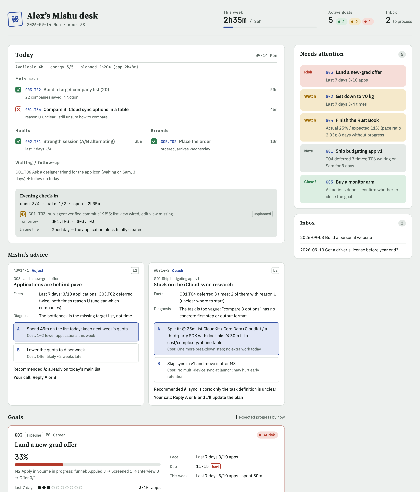
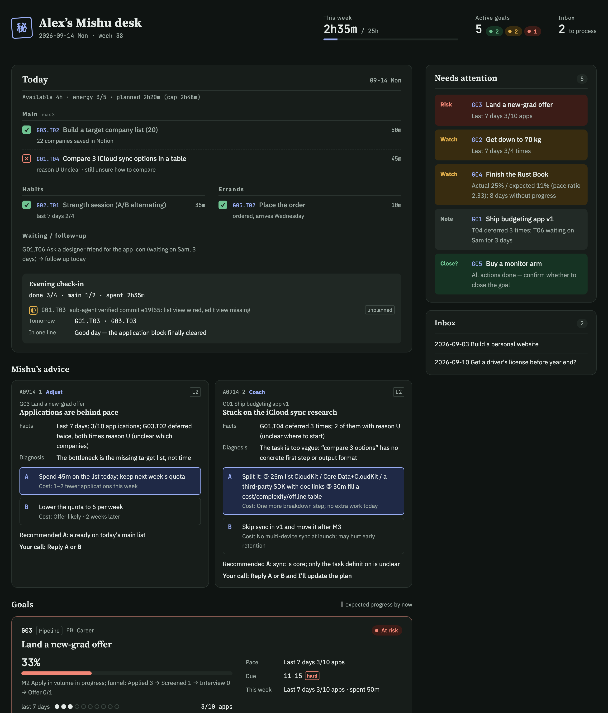
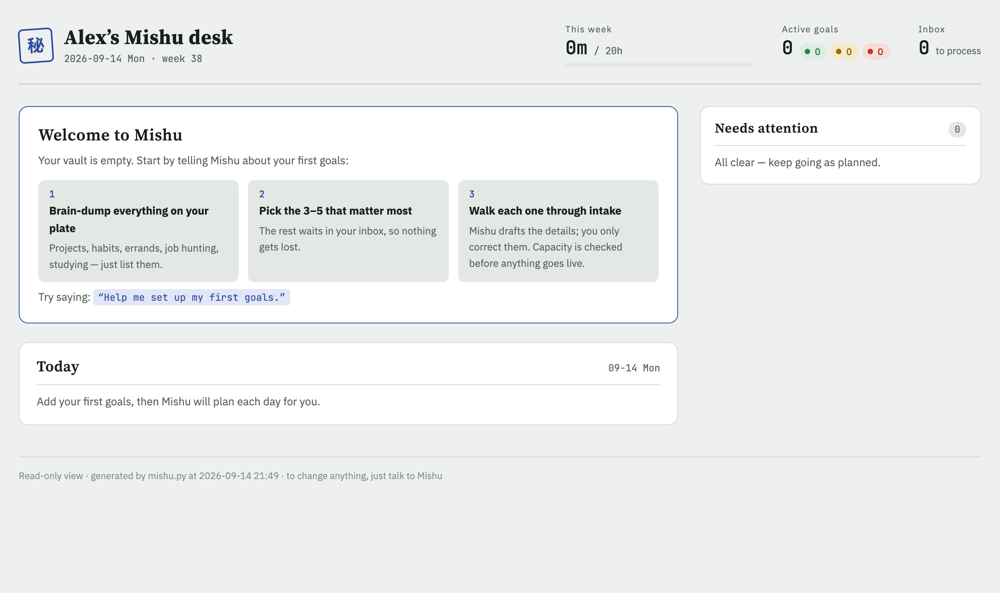

# Mishu 秘书

**English** · [简体中文](README.zh-CN.md)

**Turn Claude into your personal secretary.** Add any kind of goal, and Mishu does four things:
- plans your day under real time limits;
- runs an evening check-in, one item at a time;
- verifies progress with evidence;
- when you're stuck, offers routes, each with its cost and a recommendation.


<p align="center">
  
  
</p>

> *Mishu* (秘书, "secretary" in Chinese) is a [Claude Code](https://claude.com/claude-code) skill. Everything it outputs, from the board and daily plans to advice cards and the dashboard, is available in **English and Chinese**.

## Why

When several projects run in parallel alongside life and study, the same things keep happening:
- you spend each morning deciding what to do instead of doing it;
- a project quietly stalls for two weeks before you notice;
- one task gets postponed again and again, and nobody asks why;
- the plan grows far beyond the hours you actually have.

Existing AI planners either auto-schedule your calendar or track a single habit. The "life OS" templates for Claude Code mostly revolve around meetings and email. Mishu aims for **generality and consistency**: one model that fits every kind of goal, and one fixed format for every output.

## Features

| Feature | What it does |
|---|---|
| **Any goal, one model** | Five goal types: project, habit, errand, pipeline (job hunting, flat hunting), learning. Progress and pace methods combine freely, so goals that fit no type still work. |
| **7-step intake** | Capture → classify → clarify → break down → measure → capacity gate → confirm. Mishu drafts everything; you only correct. |
| **Daily plan** | Ranks candidates by urgency, priority, idle time and pace. At most 3 main items, total ≤ 70% of your available time. Low-energy days switch to minimum versions. |
| **Evening check-in** | Records the result, evidence and reason code for each item, writes it back to your goals, and pre-plans tomorrow. |
| **Evidence** | Code projects: a read-only sub-agent checks the commits. Body metrics: one photo request, with verbal always accepted and never pushed. Outputs: a link. |
| **Coach mode** | Works out where you're stuck (unclear, avoiding, blocked, doubting, overloaded), then offers ≤3 routes, each with its cost and a recommendation. |
| **Anti-drift rules** | After 3 deferrals, a task stops being scheduled and gets broken down instead. Idle goals turn yellow, then red. New goals can't exceed your capacity. |
| **Web dashboard** | A read-only, single-file HTML page with an expected-progress marker and a 14-day activity strip. Light and dark themes, works on mobile. |
| **Bilingual** | Set `lang: en` or `zh` per vault. Files written in either language keep working after you switch. |

## Quick start

**Requirements:** [Claude Code](https://claude.com/claude-code), Python 3.9+, macOS or Linux (Windows untested). No Python packages to install.

```bash
git clone https://github.com/T0nyN1/Mishu-skill.git
cd Mishu-skill
./install.sh            # links skill/mishu into ~/.claude/skills/mishu
```

Then, in Claude Code:

```
/mishu
```

**Your first run starts empty.** Mishu creates a fresh vault (default `~/MishuVault`, kept separate from the code), asks a few quick profile questions, and helps you add your first goals:

1. brain-dump everything on your plate;
2. pick the 3–5 that matter most;
3. walk each one through intake.

<p align="center"></p>

**Just want to look around first?** Build the demo vaults. They are generated inside `examples/` and never touch your own vault:

```bash
bash examples/build_demo.sh          # builds demo-vault-en and demo-vault-zh
open examples/demo-vault-en/dashboard.html
```

## Daily use

Talk naturally in English or Chinese, or use `/mishu <subcommand>`:

| You say | Mishu does |
|---|---|
| "I want to get down to 70 kg in three months" | runs intake: classify, clarify, break down, agree on evidence, check capacity |
| "What should I do today?" | asks your time and energy, drafts a plan, writes it after you confirm |
| "T05 is done" / sends a photo of the scale | verifies, logs progress, updates the pace light |
| "Let's review today" | goes item by item for results, evidence and reasons; writes back; pre-plans tomorrow |
| "I keep avoiding this research task" | coach mode: diagnosis, then an advice card |
| "Open the dashboard" | opens `dashboard.html` in your browser |

## How it works

```mermaid
flowchart LR
  U((You)) <--> C[Claude + Mishu skill<br/>conversation · judgment · breakdown · coaching]
  C -- only through --> S[mishu.py<br/>validation · computation · rendering · permissions]
  S --> V[(Vault ~/MishuVault<br/>Markdown, single source of truth)]
  V --> B[BOARD.md / dashboard.html]
  G[guard.py hook] -. blocks writes that bypass mishu.py .-> C
```

**The AI makes judgment calls; the script enforces the rules.** Progress percentages, pace lights, time caps and the advice-card format are all computed by `mishu.py`. Every day looks the same, and no number is ever an AI guess.

### Behavioural guarantees

| Guarantee | How |
|---|---|
| The AI records progress but can't restructure your plans on its own | Writes are progress-level or structural. Structural commands are refused without `--confirmed --reason`, and each one is logged as a decision. |
| No hand-editing data, boards or the skill | `guard.py` runs as a PreToolUse hook. It blocks Edit/Write, plus Bash redirects, `sed -i`, `rm`, `mv` and similar, on protected paths. |
| "Done" needs evidence; "not done" needs a reason | `mishu.py` rejects ✓/◐ without an evidence code, and ◐/✗/➜ without a reason code. |
| Advice has facts, costs and a recommendation | Advice cards are validated and rendered by `mishu.py`: ≤3 options, each with a cost; L2+ cards must offer options. |
| History can't be rewritten | Logs and decisions are append-only. Every write is audited in `changelog.jsonl`. Hand edits are detected by hash and re-validated. |

> ⚠️ `guard.py` stops the model from casually bypassing the rules. **It is not a security sandbox**: its Bash detection is heuristic.

### Goal types

| Type | Example | Progress | Pace |
|---|---|---|---|
| `project` | build an app | weighted phase completion | actual ÷ expected progress by date |
| `habit` | lose weight | metric from baseline to target | sessions in the last 7 days ÷ weekly target |
| `errand` | buy a monitor arm | checklist | time left before the deadline |
| `pipeline` | job hunt | weighted phases + funnel counts | weekly quota completion |
| `learning` | finish the Rust Book | mastered units ÷ total | actual ÷ expected progress by date |

Full spec: [docs/en/paradigm-spec.md](docs/en/paradigm-spec.md).

## Project layout

```
skill/mishu/                Claude Code skill (install links it to ~/.claude/skills/mishu)
├── SKILL.md                role, routing, four rules (writes / evidence / output / interaction), guard hook
├── workflows/              setup · add · today · checkin · log · stuck · status
├── references/             evidence protocol · advice card spec · vocabulary & JSON format
└── scripts/
    ├── mishu.py            the vault's only writer (standard library only)
    ├── i18n.py             Chinese translations
    ├── dashboard.py        web dashboard renderer
    └── guard.py            write guard
docs/en · docs/zh-CN        research & design proposals, paradigm spec
docs/images/                screenshots
examples/                   demo builder (EN + ZH data); generated demo vaults
tests/                      regression tests
```

Your vault:

```
~/MishuVault/
├── profile.md              capacity, tone, WIP limit, language
├── inbox.md
├── BOARD.md · dashboard.html   generated boards
├── goals/G01-*.md          goal files (single source of truth); finished goals move to _archive/
├── daily/  weekly/  evidence/
└── .mishu/                 file hashes · audit log · advice records
```

## Development

```bash
python3 -m unittest discover -s tests -v    # tests (both languages)
bash examples/build_demo.sh                 # rebuild demo vaults
```

Once `/mishu` has been invoked in a session, the guard protects the skill directory. To work on the skill in that session, **you** (not the AI) enable dev mode. The vault stays protected either way:

```bash
touch ~/.config/mishu/dev_mode    # enable
rm ~/.config/mishu/dev_mode       # disable
```

Contributions are welcome. See [CONTRIBUTING.md](CONTRIBUTING.md).

## Roadmap

- [ ] Weekly review (`/mishu week`): velocity, forecast finish dates, next week's top 3
- [ ] Scheduled triggers: morning plan and evening check-in reminders (desktop Scheduled Tasks / Routines)
- [ ] Calendar integration: real free time instead of self-reported hours
- [ ] Phone reminders and quick replies

## Docs

- [Research & design proposals](docs/en/design-proposals.md): landscape survey and three architecture options
- [Paradigm spec](docs/en/paradigm-spec.md): data model, intake flow, the four standard outputs
- [Changelog](CHANGELOG.md)

## License

[MIT](LICENSE) © 2026 Yi Ni
