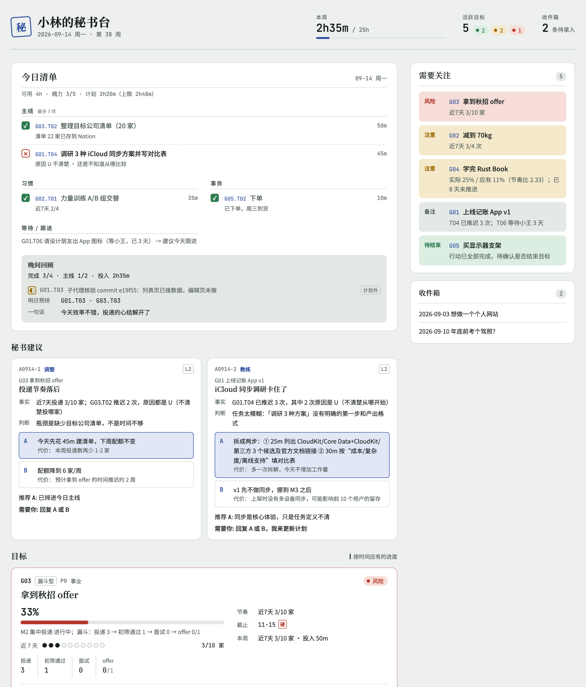
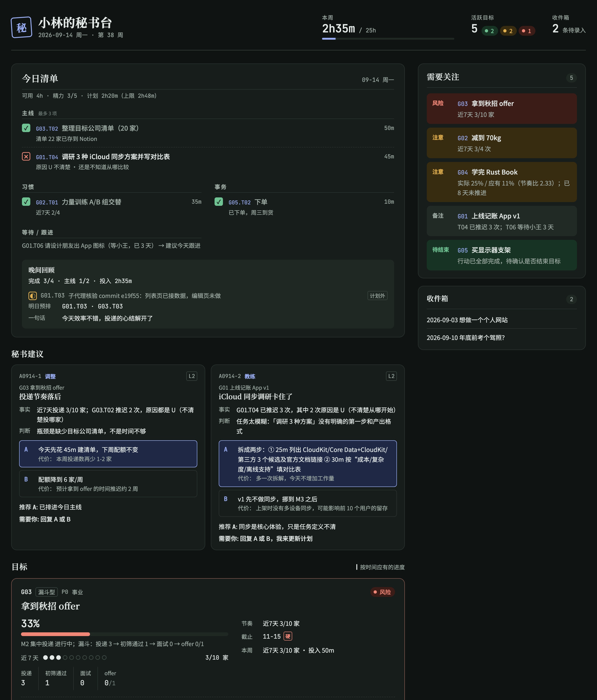

# Mishu 秘书

[English](README.md) · **简体中文**

**让 Claude 当你的私人秘书**：录入任何类型的目标，每天排出事项清单，晚上逐项回顾，核验进度；卡住时给出路线建议，每条路线都写明代价，并附上推荐。


<p align="center">
  
  
</p>

> Mishu 是一个 [Claude Code](https://claude.com/claude-code) skill。看板、每日清单、建议卡、网页看板等所有输出都支持**中文和英文**。

## 为什么做这个

同时推进好几个项目，生活和学习上也有一堆事，光靠自己管理，很容易出现这些情况：

- 每天都在想"今天做什么"，而不是直接开始做；
- 某个项目悄悄停了两周，自己却没察觉；
- 同一件事一拖再拖，却从没想过它为什么推不动；
- 计划越列越多，远远超出实际能投入的时间。

现有的 AI 规划工具，要么只管日历排程，要么只管单个习惯打卡；Claude Code 社区里的"人生操作系统"模板，大多又是围绕会议和邮件设计的。Mishu 想解决的是**通用性**和**一致性**：用一套范式装下所有类型的目标，用一套固定格式呈现所有输出。

## 功能

| 能力 | 说明 |
|---|---|
| **任意目标，一套模型** | 支持五种类型：项目、习惯、事务、漏斗（求职、找房）、学习。进度和节奏的计算方式可以自由组合，遇到没预设过的目标也能套进来 |
| **7 步录入** | 捕获 → 分类 → 澄清 → 拆解 → 度量 → 容量闸门 → 确认。秘书先写好草案，你只需要改 |
| **每日清单** | 综合截止紧迫度、优先级、多久没推进、当前节奏来排序。主线最多 3 项，总时长不超过可用时间的 70%；精力低的日子自动换成最小版本 |
| **晚间回顾** | 逐项记录结果、证据和未完成原因，自动写回目标文件，并预排明天 |
| **证据核验** | 代码项目派只读子代理查提交记录；体重等身体指标请你拍一次照片，不愿意就口头说，不会追问；有产出的事附链接 |
| **教练模式** | 先判断卡在哪里（不清楚、不想做、做不动、怀疑方向、负荷过重），再给出最多 3 条路线，每条都写明代价，并给出推荐 |
| **防烂尾** | 同一件事推迟 3 次就不再排进清单，改为引导你拆解；目标停滞会自动亮黄灯、红灯；时间不够时不能直接新增目标 |
| **网页看板** | 只读的单文件 HTML：进度条上标出"按时间应有的进度"，附近 14 天投入图；支持浅色 / 深色主题，手机上也能看 |
| **中英双语** | 每个档案库单独设置 `lang: zh` 或 `en`；切换语言后，之前写下的文件照样能读 |

## 快速开始

**环境要求**：[Claude Code](https://claude.com/claude-code)、Python 3.9+、macOS 或 Linux（Windows 暂未测试）。不需要安装任何 Python 包。

```bash
git clone https://github.com/T0nyN1/Mishu-skill.git
cd Mishu-skill
./install.sh            # 把 skill/mishu 链接到 ~/.claude/skills/mishu
```

然后在 Claude Code 中输入：

```
/mishu
```

**第一次使用时，档案库是空的。** 秘书会先新建档案库（默认 `~/MishuVault`，和代码分开存放），快速了解你的作息和可用时间，再带你录入第一批目标：先把手头的事一口气说出来，挑出最重要的 3–5 个，然后逐个走一遍录入流程。

**只想先看看效果？** 生成演示档案库。它只生成在 `examples/` 目录里，不会进入你自己的档案库：

```bash
bash examples/build_demo.sh          # 同时生成 demo-vault-zh 和 demo-vault-en
open examples/demo-vault-zh/dashboard.html
```

## 日常使用

直接说中文或英文就行，也可以用 `/mishu <子命令>`：

| 你说 | 秘书会做什么 |
|---|---|
| "我想三个月内减到 70kg" | 走录入流程：分类、澄清、拆解、商定证据方式、检查时间容量 |
| "今天做什么" | 问你今天有多少时间、精力如何，排出清单草案，你确认后写入 |
| "T05 做完了" / 发一张秤的照片 | 核验后记录进度，更新节奏灯 |
| "回顾一下" | 逐项确认结果、证据和原因，写回数据，并预排明天 |
| "这个调研我一直不想碰" | 进入教练模式，先诊断，再给出建议卡 |
| "打开看板" | 在浏览器中打开 `dashboard.html` |

## 工作原理

```mermaid
flowchart LR
  U((你)) <--> C[Claude + Mishu skill<br/>对话 · 判断 · 拆解 · 诊断]
  C -- 只能通过 --> S[mishu.py<br/>校验 · 计算 · 渲染 · 权限]
  S --> V[(档案库 ~/MishuVault<br/>Markdown 唯一数据源)]
  V --> B[BOARD.md / dashboard.html]
  G[guard.py hook] -. 拦截绕过 mishu.py 的写入 .-> C
```

**AI 负责判断，脚本负责规则。** 进度百分比、节奏灯、时长上限、建议卡格式都由 `mishu.py` 按固定规则处理，所以每天看到的内容结构始终一致，数字也不是 AI 估出来的。

### 行为约束

| 约束 | 实现方式 |
|---|---|
| AI 只能记录进度，不能擅自修改计划结构 | 写入分为"进度级"和"结构级"。结构级命令（比如改截止日期、暂停目标）不带 `--confirmed --reason` 会被拒绝，执行后还会自动记一条决策 |
| AI 不能手改数据、看板或 skill 代码 | `guard.py` 作为 PreToolUse hook，拦截 Edit / Write 工具，以及 Bash 里的重定向、`sed -i`、`rm`、`mv` 等写操作 |
| 标记完成必须有证据，没完成必须写原因 | 标记完成或部分完成时缺证据、标记没做或改期时缺原因，`mishu.py` 都会直接拒绝 |
| 建议必须有依据、写明代价、给出推荐 | 建议卡由 `mishu.py` 校验后渲染：最多 3 个选项，每个都要写代价；需要你拍板的建议必须给出选项 |
| 历史记录不可篡改 | 日志和决策只能追加；每次写入都记进 `changelog.jsonl`；你手动改过的文件会通过哈希被发现，写入前重新校验 |

> ⚠️ `guard.py` 是为了防止模型"顺手绕过规则"，**不是安全沙箱**。它对 Bash 命令的识别是启发式的，挡不住刻意的规避。

### 目标类型

| 类型 | 例子 | 进度怎么算 | 节奏怎么判断 |
|---|---|---|---|
| 项目 `project` | 写一个 App | 各阶段按权重累计完成度 | 实际进度 ÷ 按时间应有的进度 |
| 习惯 `habit` | 锻炼减肥 | 指标从起点到目标走了多少 | 近 7 天完成次数 ÷ 每周目标次数 |
| 事务 `errand` | 买显示器支架 | 清单完成了几项 | 离截止日期还有多久 |
| 漏斗 `pipeline` | 秋招 | 各阶段按权重累计完成度，另记漏斗各环节人数 | 每周行动配额完成了多少 |
| 学习 `learning` | 学完 Rust Book | 已掌握单元 ÷ 总单元 | 实际进度 ÷ 按时间应有的进度 |

完整规范见 [docs/zh-CN/paradigm-spec.md](docs/zh-CN/paradigm-spec.md)。

## 项目结构

```
skill/mishu/                Claude Code skill（安装后链接到 ~/.claude/skills/mishu）
├── SKILL.md                角色、路由、四条铁律（写入 / 证据 / 输出 / 交互）、guard hook
├── workflows/              setup · add · today · checkin · log · stuck · status
├── references/             证据核验协议 · 建议卡规范 · 词汇表与 JSON 格式
└── scripts/
    ├── mishu.py            档案库的唯一写入器（只用标准库）
    ├── i18n.py             中文翻译
    ├── dashboard.py        网页看板模板
    └── guard.py            写入守卫
docs/zh-CN · docs/en        调研与设计方案、范式规范
docs/images/                截图
examples/                   演示档案库的生成脚本（中英两套数据）和生成结果
tests/                      回归测试
```

## 开发

```bash
python3 -m unittest discover -s tests -v    # 运行测试（覆盖中英两种语言）
bash examples/build_demo.sh                 # 重新生成演示数据
```

skill 被调用后，guard 会保护 skill 目录不被修改。如果要在已经调用过 `/mishu` 的会话里开发，需要**由你本人**开启开发模式（档案库始终受保护）：

```bash
touch ~/.config/mishu/dev_mode    # 开启
rm ~/.config/mishu/dev_mode       # 关闭
```

欢迎贡献，请先阅读 [CONTRIBUTING.zh-CN.md](CONTRIBUTING.zh-CN.md)。

## 路线图

- [ ] 周复盘（`/mishu week`）：统计推进速度、预测完成时间、排出下周 Top 3
- [ ] 定时触发：早间清单和晚间回顾提醒（桌面端 Scheduled Tasks / Routines）
- [ ] 接入日历：用实际空闲时间代替手动报告的可用时长
- [ ] 手机端提醒与快速回复

## 文档

- [调研与设计方案](docs/zh-CN/design-proposals.md)：同类产品调研，三种架构方案对比
- [通用范式规范](docs/zh-CN/paradigm-spec.md)：数据模型、录入流程、四种标准输出格式
- [更新日志](CHANGELOG.md)

## License

[MIT](LICENSE) © 2026 Yi Ni
