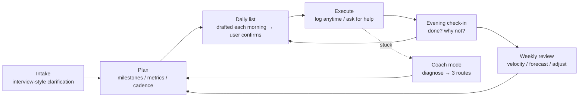
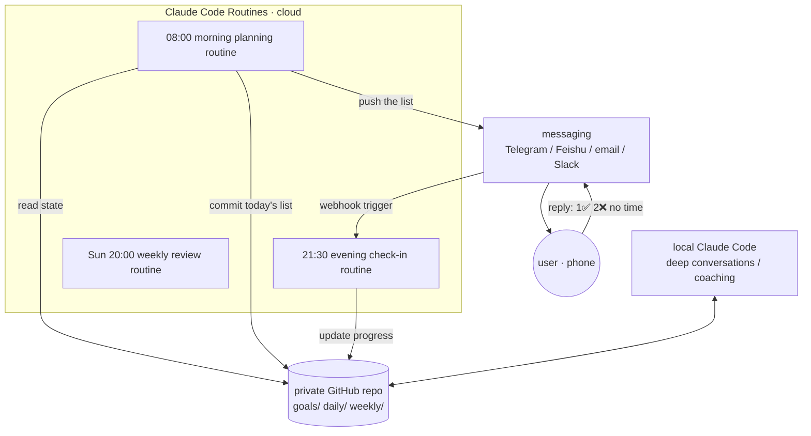
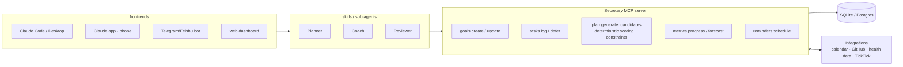

# AI personal secretary: research & design proposals

> 📜 **Historical document.** Written before the project was named Mishu (秘书); "Secretary" and the `/sec-*` commands below are early working names. The final implementation follows proposal A. See the [paradigm spec](paradigm-spec.md).
>
> 中文版：[../zh-CN/design-proposals.md](../zh-CN/design-proposals.md)

> Date: 2026-09-14
> Goal: build a general-purpose "AI personal secretary" skill or pipeline on Claude. It should manage any kind of goal, supervise progress, produce a daily to-do list, and suggest routes when the user is stuck.

---

## 1. Research findings

### 1.1 The short version

**There's more out there than expected, but nothing fully fits.** Existing options fall into three groups:

| Group | Examples | What they do | Gap vs. our needs |
|---|---|---|---|
| **"Life OS" templates for Claude Code** | [Dex](https://github.com/davekilleen/dex), [lifeos-template](https://github.com/seandavi/lifeos-template), [life-system](https://github.com/davidhariri/life-system), [claude-code-cos](https://github.com/jimprosser/claude-code-cos), [ai-chief-of-staff](https://github.com/Akshat2430/ai-chief-of-staff), [ceo-personal-os](https://github.com/2389-research/ceo-personal-os) | Markdown repos with commands like `/morning`, `/daily-plan`, `/weekly-review`; goals cascade quarter → week → day | ① Built for knowledge workers and executives around meetings, email and contacts, **not "any goal"**. ② Mostly user-triggered, **no proactive supervision**. ③ No type-specific progress measures (losing weight and building an app share one task list). ④ No Chinese support or local tool integrations |
| **Anthropic's official plugin** | [knowledge-work-plugins / productivity](https://github.com/anthropics/knowledge-work-plugins/tree/main/productivity) | `TASKS.md` (Active / Waiting On / Someday / Done), two-tier memory (CLAUDE.md + memory/), an HTML dashboard, `/start` and `/update` | Essentially **a task list plus workplace memory**. No goal layer, progress model, daily scheduling or coaching. A good reference base |
| **Standalone AI planning / accountability apps** | Motion, Reclaim (calendar auto-scheduling), Sunsama (guided daily planning), Nag Bot, Accountability Coach AI, Rocky.ai, GoalsWon (human coaches) | Auto-scheduling, check-ins, push reminders, chat-style accountability | Closed data and little customisation. Calendar tools are good at *placing time*, not at *judging direction*. Accountability apps mostly track single habits, not parallel projects. $19–25/month |

Skill marketplaces also have scattered entries, such as the Task Management and Personal Assistant skills on mcpmarket, or the "Accountability Buddy" skill on Medium. Most are a simple list plus check-ins.

### 1.2 Ideas worth borrowing

- **lifeos-template's "feedback layer."**
  - Periodic audits of stalled goals.
  - A quarterly forced decision on every stale goal: rewrite it or formally drop it.
  - Decisions logged with 30/90/365-day predictions that get revisited later.

  This **stops plans from quietly rotting**, and most templates lack it.
- **Dex's goal hierarchy.** Strategic pillars → quarterly goals (3–5) → weekly priorities (top 3) → daily plan → task backlog. It also uses MCP to give tasks unique IDs: "check it off once, it updates everywhere."
- **Sunsama vs. Motion.** Motion treats planning as overhead to automate. Sunsama treats the act of planning as the value and slows you down each morning to choose. **We take the middle path: the AI drafts, the user confirms and edits.**
- **What the Claude platform offers today:**
  - **Claude Code Routines** (launched April 2026): cloud cron jobs with a minimum interval of 1 hour. **Each run starts with no memory**, so state must live in a git repo or an external system.
  - **Desktop Scheduled Tasks**: run locally, and catch up on missed runs when the machine wakes.
  - Skills, hooks, MCP connectors (calendar, Notion, Slack…) and push notifications.

### 1.3 The gaps this product fills

1. **Any kind of goal.** Projects, habits, errands, job hunting and learning each define "progress" differently.
2. **Proactive supervision.** Show up on schedule, follow up, and escalate gradually, instead of waiting to be asked.
3. **Unified scheduling across goals.** When several projects run in parallel, balance urgency, importance, neglect and unblocking value every day.
4. **Diagnosis when stuck.** First find where the user is stuck (unclear next step, avoidance, can't move, doubting the direction, overload), then offer routes, not generic encouragement.
5. **Self-correcting plans.** Repeated deferrals trigger a breakdown or a rethink instead of endless postponement.
6. **Chinese & localisation.** Chinese conversations; optional integrations with TickTick, Feishu, WeChat and similar tools.

---

## 2. Shared core design (independent of the proposal)

Whichever proposal wins, this **domain model** and **work loop** apply.

### 2.1 Core loop



### 2.2 Goal type templates

A "goal" is one file or record. Its **type** decides how it is tracked.

| Type | Examples | How progress is measured | Default cadence | Diagnosis focus when stuck |
|---|---|---|---|---|
| `project` | build an app, a thesis | milestone completion, plus forecast finish vs. deadline | weekly milestone review | Is the next step clear? Is a dependency blocking? |
| `habit` / metric | exercise to lose weight, daily vocabulary | **lead measures** (sessions) + **lag measures** (weight trend) + streaks | daily check-in, weekly trend | Where are the triggers and friction? Is the target too high? |
| `errand` | purchases, paperwork, shipping | done / not done | by deadline, batched | Rarely stuck; usually missing information |
| `pipeline` / exploration | job hunt, flat hunt, fundraising | counts per funnel stage (applied → test → interview → offer), weekly action quota | weekly conversion review | Too little volume or a low conversion rate? Does the positioning need to change? |
| `learning` | an exam, a new technology | syllabus coverage, **proven by output** (exercise accuracy, explaining it, a small project) | daily study, spaced review | Is it pretend studying (reading without practising)? |

A suggested goal file (YAML frontmatter + Markdown):

```yaml
---
id: g-2026-007
title: Ship budgeting app v1
type: project
area: Career         # Career / Learning / Health / Life / Finance / Relationships
priority: P1         # P0-P3
status: active       # draft / active / paused / done / dropped
deadline: 2026-11-30
why: Portfolio piece + prove I can ship solo      # motivation, used in coaching
success_criteria: Live on the App Store with 10 real users
cadence: weekly_review
effort_budget: 8h/week
milestones:
  - {id: m1, title: Requirements & prototype, due: 2026-09-25, status: done}
  - {id: m2, title: Core expense tracking, due: 2026-10-20, status: active}
  - {id: m3, title: Launch, due: 2026-11-30, status: todo}
next_actions:
  - {id: t41, title: Implement local expense CRUD, est: 90m, milestone: m2, deferred: 0}
  - {id: t42, title: Research iCloud sync options, est: 45m, milestone: m2, deferred: 2}
---
## Log
- 2026-09-13 Prototype review done; decided to drop multi-currency
```

### 2.3 Daily list rules

**Inputs:**
- next actions of every active goal;
- habits due today, and deadlines;
- yesterday's results and leftovers;
- free calendar time (optional);
- **the energy and available time the user reports in the morning** (e.g. "4 hours today, energy 3/5").

**Scoring** (judged by the LLM against rules; in proposal C, computed in code):

```
score = urgency (slack until the deadline)
      + importance (goal priority)
      + neglect (days since last progress ÷ expected cadence)
      + unblocking value (how many dependencies it frees)
      + habit due
```

**Hard constraints:**
- Total estimated time ≤ available time × 0.7, to leave a buffer.
- **At most 3 main tasks (MITs).**
- Every active goal moves at least once per cadence period, so no project is forgotten.
- A task **deferred 3+ times is no longer scheduled**. It triggers a "break down or challenge" step instead: too big, unclear, or not actually wanted?
- Low-energy days swap in low-effort work such as errands and tidying.

**Output format:**

```
📅 Sun Sep 14 · 4h available · energy 3/5

🎯 Main (must do)
  1. [Budget app] Implement local expense CRUD · 90m
  2. [Job hunt] Apply to 3 companies (list ready) · 45m
⚡ Spare moments (errands)
  - [Shopping] Order the monitor arm · 10m
🔁 Habits
  - [Weight] Strength session A · 40m (2/4 this week)
👀 Waiting on others
  - [Job hunt] Second-round result from Company X (5 days; follow up Tuesday)
⚠️ Heads-up
  - "Research iCloud sync" has been deferred twice; let's break it down at tonight's check-in
```

### 2.4 Supervision: escalate, don't nag

| Level | Trigger | What the secretary does |
|---|---|---|
| L0 | normal progress | only the morning list and evening check-in |
| L1 | today's main items not done | ask why at check-in (options: no time / unclear / don't want to / blocked) |
| L2 | a task deferred 3 times, or a goal idle for 7 days | suggest splitting it, or a 15-minute "minimum start" version |
| L3 | a goal behind plan for two weeks running | estimate the slip in the weekly review and ask for an **explicit choice**: extend / cut scope / pause / drop |
| L4 | 3+ goals red at once | run a "load review" and bring the number of goals down |

The **tone** is configurable (gentle / coach / strict), and check-ins can be **evidence-based**: GitHub commits, fitness app screenshots or weight logs can all show that something was really done.

### 2.5 Coach mode (stuck or lost)

Diagnose first, then offer routes:

1. **Unclear** (doesn't know the next step) → break it down to a first step of ≤25 minutes that can start now.
2. **Avoidance** → shrink the task, start with 2 minutes, tie it to an existing habit, and revisit the `why`.
3. **Can't move** (missing skill or resources) → a learning path, people or communities to ask, alternatives.
4. **Doubting the direction** → revisit the success criteria. Pausing or dropping is allowed and is recorded as a decision.
5. **Overload** → list every goal and make trade-offs together.

**The output is always "3 routes + the cost of each + my recommendation"**, and the plan updates once the user picks.

---

## 3. Proposals

### Proposal A: pure skill + local Markdown vault (lightweight, local-first)

**Shape:** a Claude Code skill (or a plugin with several skills), with data in a local folder, ideally under git.

```
~/Secretary/                     # the user's vault
├── CLAUDE.md                    # profile: routine, preferences, tone, weekly availability
├── goals/
│   ├── g-2026-007-budget-app.md
│   ├── g-2026-008-weight.md
│   └── _archive/
├── inbox.md                     # quick capture
├── daily/2026-09-14.md          # daily list + check-in
├── weekly/2026-W37.md           # weekly review
├── decisions/                   # major decisions (with revisit dates)
└── dashboard.html               # optional: generated visual dashboard
```

**Commands:**

| Command | Purpose |
|---|---|
| `/sec-setup` | First interview: routine, life areas, all current goals; generates CLAUDE.md and goal files |
| `/sec-goal` | Add or edit a goal: interview, auto-classify, break into milestones and next actions |
| `/sec-today` | Generate today's list (asks energy and available time first) |
| `/sec-done` / `/sec-log` | Log progress anytime |
| `/sec-checkin` | Evening check-in: item by item, ask why, carry over leftovers |
| `/sec-week` | Weekly review: velocity per goal, forecast finish dates, lights, next week's top 3 |
| `/sec-stuck` | Coach mode |
| `/sec-audit` | Monthly audit: stalled goals, too many goals, neglected areas |

**Automation:** desktop Scheduled Tasks run `/sec-today` at 8:00, a `/sec-checkin` reminder at 22:00, and `/sec-week` on Sundays.

| Pros | Cons |
|---|---|
| Zero infrastructure; an MVP in 1–2 days | Supervision needs the computer on; weak on phones |
| Transparent, readable data; works in Obsidian or any editor | If the LLM parses Markdown to compute progress, the numbers can be wrong |
| Easiest to share: clone the template and go | The user must open Claude for the check-in |
| Native to Claude Code (skills, memory, hooks) | Context cost grows as files pile up |

**Best for:** personal use first, to validate the flow quickly.

---

### Proposal B: plugin + private git repo + cloud Routines + messaging (proactive supervision)

**Shape:** proposal A's data model, with the "brain" running on a schedule in the cloud and the "reach" moved to the phone.



**Key design points:**
- Routines **have no memory between runs**, so **the repo is the single source of truth** and every run ends with a commit.
- Replies flow back through a Routine's **API trigger** (each routine has its own HTTP endpoint). A small relay is needed, such as a Cloudflare Worker or a Feishu/Telegram bot.
- Deep conversations (goal intake, coaching) still happen in local Claude Code or the Claude app, against the same repo.
- Escalation can be its own routine that sends an extra message when something is overdue.

| Pros | Cons |
|---|---|
| **Real proactive supervision**, received and answered on the phone | Requires building a bot and webhooks |
| Doesn't need the computer on | Routines run at most hourly and consume Claude usage |
| Git history is a natural audit trail | Turning quick replies into structured updates is error-prone and needs fault tolerance |
| For others: fork the repo and configure a bot, moderate effort | Personal data passes through a third-party messaging platform, a privacy concern |

**Best for:** after A's flow works, when you want the feeling that someone is really watching.

---

### Proposal C: MCP server + structured database + multi-agent (full product)

**Shape:** a custom **Secretary MCP server** (Python or TypeScript, SQLite storage). **Deterministic logic lives in code; judgment and conversation belong to the LLM.** Claude Code, Claude Desktop, the Claude app (via remote MCP) and bots can all act as front-ends.



**Division of labour:**
- **Code:** CRUD, scoring and ranking, capacity constraints, progress percentages, burn-down and forecast dates, streaks, deferral counts, scheduled reminders.
- **LLM:** intake interviews, turning vague goals into SMART goals, final selection among candidates with reasons, coaching diagnosis, review insights and wording.
- **Sub-agents:**
  - Planner: daily and weekly planning.
  - Coach: diagnosis when stuck.
  - Reviewer: reviews, and plays devil's advocate (e.g. "you added 4 goals this month and finished none").

| Pros | Cons |
|---|---|
| Accurate numbers, trend charts and forecasts | Most development work; several weeks |
| Many front-ends, including phones | Needs deployment; remote MCP needs auth |
| Evidence-based supervision from external data (commits, weight, calendar) | Data is no longer "open it and read it" text (exports help) |
| Best fit for "anyone can use it" | Easy to over-engineer too early |

**Variant C′ (bolt-on):** skip the custom database and use **TickTick / Notion / Todoist** MCP servers for storage and reminders, with the secretary as the "brain" only. Phone reminders and UI come for free, but you're limited by their data model (pipeline and metric goals are hard to express).

---

## 4. Comparison & recommendation

| Dimension | A: pure skill | B: skill + cloud push | C: MCP product |
|---|---|---|---|
| Time to MVP | 1–2 days | 1 week | 3–6 weeks |
| Proactive supervision | ★★ | ★★★★ | ★★★★ |
| Progress accuracy | ★★ | ★★ | ★★★★★ |
| Phone experience | ★ | ★★★★ | ★★★★ |
| Sharing / reuse effort | lowest | medium | medium-high |
| Maintenance | low | medium | high |

### Recommendation: evolve A → B → C, with one data model from day one

1. **Phase 1 (this week):** build **proposal A**. Polish four things: goal type templates, daily list rules, the evening check-in, and coach mode. **Use it yourself for two weeks** and note what hurts.
2. **Phase 2:** add **proposal B's push** on top of A. Start with the simplest channel (desktop Scheduled Tasks + push notifications, or email). Build a bot only once two-way replies on the phone prove necessary.
3. **Phase 3:** if Markdown statistics start going wrong, or others will use it, extract the "data + computation" layer into an **MCP server (proposal C)**. The skill layer barely changes.

**Key principles:**
- **AI drafts, the user decides.** A daily list only takes effect after the user confirms and adjusts it, which preserves the value of planning itself.
- **Less is more.** At most 3 main tasks; cap the number of active goals (suggested ≤5).
- **Failure is allowed; replan.** Deferral isn't a sin, but it triggers diagnosis. Dropping a goal is a formal decision.
- **Numbers over feelings.** "2/4 strength sessions this week", not "been training okay lately".

---

## 5. Open questions for the user

1. **Main context:** mostly at the computer (Claude Code / Desktop), or reminders and replies on the phone? This decides whether phase 1 includes push.
2. **Where data lives:** plain local Markdown? A private GitHub repo? Or the tools already in use (TickTick, Notion, Feishu)?
3. **Supervision strength and tone:** gentle / coach / strict?
4. **External data as evidence:** calendar, GitHub, health data?
5. **Audience:** personal use first, or an open-source template anyone can install from the start? This affects how configurable it needs to be and how much documentation it needs.

---

## References

- [Dex – AI Chief of Staff](https://github.com/davekilleen/dex)
- [lifeos-template](https://github.com/seandavi/lifeos-template)
- [life-system](https://github.com/davidhariri/life-system)
- [claude-code-cos](https://github.com/jimprosser/claude-code-cos)
- [ai-chief-of-staff](https://github.com/Akshat2430/ai-chief-of-staff)
- [ceo-personal-os](https://github.com/2389-research/ceo-personal-os)
- [claude-task-manager](https://github.com/vibehat/claude-task-manager)
- [Anthropic knowledge-work-plugins / productivity](https://github.com/anthropics/knowledge-work-plugins/tree/main/productivity)
- [Claude Code for Life #2: A Personal AI Chief of Staff (Medium)](https://medium.com/data-science-collective/claude-code-for-life-2-a-personal-ai-chief-of-staff-for-daily-work-357b6c35573f)
- [Beyond Coding: Your Accountability Buddy with Claude Code Skill (Medium)](https://medium.com/@ooi_yee_fei/beyond-coding-your-accountability-buddy-with-claude-code-skill-45f91b54408f)
- [Claude Code Routines guide (MakerKit)](https://makerkit.dev/blog/tutorials/claude-code-routines-guide)
- [Claude Code Scheduled Tasks guide](https://claudefa.st/blog/guide/development/scheduled-tasks)
- [Sunsama vs Motion vs Reclaim (Skedul.AI)](https://skedul.ai/blog/sunsama-vs-motion-vs-reclaim)
- [Best Accountability Apps 2026 (GoalsWon)](https://www.goalswon.com/blog/23-apps-that-will-keep-you-accountable-and-motivated-to-achieve-all-your-personal-goals/)
- [Nag Bot](https://nag.bot/) · [Accountability Coach AI](https://accountabilitycoach.ai/)
