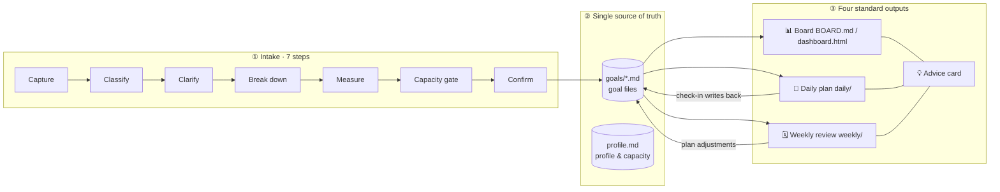
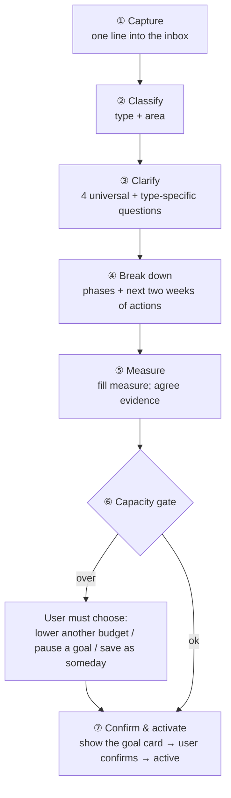

# Mishu paradigm spec

> This spec defines three things: **how goals come in** (the intake flow), **how data is stored** (one model), and **how information is shown** (four standard formats).
> The design principle: **one model holds every goal, and one vocabulary runs through every output.** What you see each day always has the same structure; only the content changes.
>
> 中文版：[../zh-CN/paradigm-spec.md](../zh-CN/paradigm-spec.md)

---

## 0. Overview



**Three ground rules**
1. **Single source of truth.** Goals, phases, actions, logs and decisions live only in `goals/*.md`. Daily plans and weekly reviews are logs plus references; the board is a generated view.
2. **Everything has an ID.** Every item on a plan, the board or an advice card carries an ID (e.g. `G01.T05`) that points back to its goal file.
3. **The AI doesn't do arithmetic.** Progress percentages, pace lights and weekly totals come from the script's formulas. The AI handles judgment and wording.

---

## 1. Shared vocabulary

Every output uses only the symbols and codes defined here.

### 1.1 IDs

| Object | Format | Example |
|---|---|---|
| Goal | `G` + two digits | `G01` |
| Phase | `<goal>.M` + number | `G01.M2` |
| Action | `<goal>.T` + number | `G01.T05` |
| Decision | `<goal>.D` + number | `G01.D03` |
| Advice card | `A` + date + number | `A0914-1` |

Inside a goal file the goal prefix may be dropped (`T05`). Across files, always use the full form.

### 1.2 Goal types

| Icon | type | Name | How to recognise it |
|---|---|---|---|
| 🏗 | `project` | Project | a clear deliverable built over several phases |
| 🔁 | `habit` | Habit | repeated behaviour that changes a metric or state |
| 📦 | `errand` | Errand | done in a few steps, ≤3h total |
| 🎯 | `pipeline` | Pipeline | the outcome depends on other people's choices; needs many attempts (job hunting, flat hunting, pitching) |
| 📚 | `learning` | Learning | the goal is to master knowledge or a skill |

### 1.3 Statuses

**Goal `status`:**
`inbox` (just captured) → `draft` (being set up) → `active` ⇄ `paused` → `done` / `dropped`. There is also `someday`, which uses no capacity.

**Action status** is a checkbox:

| Mark | Meaning |
|---|---|
| `[ ]` | to do |
| `[/]` | in progress |
| `[x]` | done |
| `[!]` | blocked / waiting on someone |
| `[-]` | cancelled |

### 1.4 Pace lights (all goal types)

| Light | Meaning | Rule (see §3.3) |
|---|---|---|
| 🟢 | on track | pace ratio ≥ 0.9 |
| 🟡 | watch | ratio 0.7–0.9, or idle longer than `stale_days` |
| 🔴 | at risk | ratio < 0.7, deadline at risk, or idle longer than 2 × `stale_days` |
| ⚪ | not started | active, but the start date is in the future |
| ⏸ | paused | status = paused |
| ✅ | done | status = done |

### 1.5 Result codes (used at check-in)

| Code | Meaning |
|---|---|
| ✓ | done |
| ◐ | partly done |
| ✗ | not done |
| ➜ | rescheduled on purpose |
| ✂ | cancelled (no longer needed) |

### 1.6 Reason codes (the data behind coaching)

| Code | Meaning | Coaching strategy |
|---|---|---|
| `T` | no time (something else took it) | check capacity, adjust budgets |
| `E` | low energy | move to a low-energy slot, or do the minimum version |
| `U` | unclear how, or what the next step is | **break it down**; define the first step |
| `A` | avoiding it | shrink it, start with 2 minutes, revisit the why |
| `B` | blocked (waiting on people or resources) | mark `[!]`, schedule a follow-up or find an alternative |
| `O` | underestimated the work | re-estimate, split what's left |
| `P` | the plan changed | cancel or reschedule |

### 1.7 Evidence codes

| Code | Meaning |
|---|---|
| 🔍 | code check (sub-agent inspected the repo) |
| 📷 | photo |
| 🔗 | link or file |
| 💬 | verbal report |
| ⚙️ | system entry |

### 1.8 Priority

`P0` must (serious consequences if skipped) · `P1` important · `P2` want · `P3` nice to have.

Priority is set during intake **by comparing with existing goals**, not by gut feeling.

---

## 2. Vault layout

```
MishuVault/                     # the user's vault (kept separate from the skill code)
├── profile.md                  # profile: capacity, routine, preferences, limits, language
├── inbox.md                    # quick capture, waiting for intake
├── BOARD.md                    # 📊 board (generated — don't edit)
├── dashboard.html              # 📊 web dashboard (generated, read-only)
├── goals/
│   ├── G01-Ship-budgeting-app-v1.md
│   ├── G02-Get-down-to-70-kg.md
│   └── _archive/               # done / dropped goals
├── daily/
│   └── 2026-09-14.md           # 📅 daily plan + evening check-in
├── weekly/
│   └── 2026-W37.md             # 🗓 weekly review
├── evidence/                   # evidence files the user chose to keep
└── .mishu/                     # file hashes, audit log, advice records

# Validation, computation and rendering are done by mishu.py in the skill; the vault holds no code.
```

---

## 3. Data model

### 3.1 Profile `profile.md`

```yaml
---
name: Alex
lang: en                    # en | zh — language of every rendered output
weekly_capacity: 25h        # total weekly hours for all goals
daily_default: 3h           # typical weekday availability
weekend_default: 5h
wip_limit: 5                # max active goals (habits count 0.5)
stale_days: 7               # idle days before the light turns yellow
tone: coach                 # gentle / coach / strict
day_start: "08:30"
checkin_time: "21:30"
areas: [Career, Learning, Health, Life, Finance, Relationships]
---
## Background
(student / employed, routine, common distractions…)
```

### 3.2 Goal file: one skeleton

**Every goal, whatever its type, uses the same skeleton.** The type only decides how `measure` is filled in.

```markdown
---
id: G01
title: Ship budgeting app v1
type: project
area: Career
priority: P1
status: active
created: 2026-09-14
start: 2026-09-15
deadline: 2026-11-30!       # trailing ! marks a hard deadline
why: Portfolio piece + prove I can ship solo
done_when: Live on the App Store with 10 real users
budget: 8h/w
review: weekly
verify:
  method: repo
  repo: ~/code/budget-app
  when: every
  fallback: verbal
measure:
  progress: phases          # how progress is computed
  pace: timeline            # how pace is judged
phases:
  - {id: M1, title: Requirements & prototype, weight: 1, due: 2026-09-25, status: done}
  - {id: M2, title: Core expense tracking, weight: 2, due: 2026-10-20, status: active}
  - {id: M3, title: Polish & launch, weight: 1, due: 2026-11-30, status: todo}
---

## Actions
- [x] T01 Wireframe the 5 core screens · 90m · M1
- [x] T02 Pick the stack · 45m · M1
- [/] T05 Implement local expense CRUD · 120m · M2 · due:2026-09-20
- [ ] T06 Compare iCloud sync options · 45m · M2 · defer:2
- [!] T07 Get the icon from a designer friend · M2 · wait:Sam · since:2026-09-10

## Log
- 2026-09-13 | T02 | ✓ | 45m | 🔍 | SwiftUI + SwiftData chosen
- 2026-09-14 | T05 | ◐ | 60m | 🔍 | [O] model layer done, UI not wired

## Decisions
- 2026-09-13 | D01 | Drop multi-currency support | Reason: keep v1 focused | Revisit: 2026-12-01
```

**Action line syntax.** Fields appear in a fixed order, separated by ` · `:

```
- [status] T<n> Verb-first title · estimate · phase · [optional fields…]
```

Optional fields:
- `due:YYYY-MM-DD` — due date
- `defer:N` — times deferred
- `every:mon,wed,fri` — recurrence for habits
- `qty:10` — quantity for quota tasks
- `wait:someone` · `since:YYYY-MM-DD` — who it's blocked on, and since when
- `min:10m` — minimum version for low-energy days

**Log line syntax** (6 columns):

```
- date | ref | result code | time or value | evidence code | note
```

- A note that starts with `[U]` carries a reason code.
- For metric logs, `ref` is the metric name, e.g. `- 2026-09-14 | Weight | = | 76.4kg | 📷 | morning, before breakfast`.

### 3.3 Measurement: two dimensions, freely combined

Every goal produces the same **progress trio**: **progress %**, **pace light** and **next action**. Only the calculation differs.

**Four `progress` methods**

| Value | Formula | Typical use |
|---|---|---|
| `phases` | Σ(weight × phase completion) ÷ Σ weight. Phase completion: done = 1, todo = 0, active = estimated time of finished actions ÷ total estimated time | projects, pipelines |
| `metric` | (current − baseline) ÷ (target − baseline), clamped to 0–100% | weight loss, savings, running pace |
| `units` | mastered units ÷ total units | learning |
| `checklist` | finished actions ÷ all actions | errands |

**Three `pace` methods**

| Value | Pace ratio | Typical use |
|---|---|---|
| `timeline` | actual progress ÷ expected progress, where expected = (today − start) ÷ (deadline − start). During the first 10% of the time, only staleness counts | projects and learning with deadlines |
| `frequency` | completions in the last 7 days ÷ weekly target (with a ramp-up allowance in the first week) | habits, pipeline quotas |
| `deadline` | ≤ 2 days left and not done → 🔴; ≤ 7 days and not started → 🟡; otherwise 🟢 | errands |

**Type defaults** (filled in at intake; can be overridden)

| Type | progress | pace | Extra `measure` fields |
|---|---|---|---|
| 🏗 project | phases | timeline | — |
| 🔁 habit | metric | frequency | `metric`, `frequency` |
| 📦 errand | checklist | deadline | — |
| 🎯 pipeline | phases | frequency | `funnel`, `frequency` |
| 📚 learning | units | timeline | `units` |

> A goal that fits none of the types just picks one progress method and one pace method. **No new type is needed.**

`measure` examples:

```yaml
# 🔁 habit — lose weight
measure:
  progress: metric
  pace: frequency
  metric: {name: Weight, unit: kg, baseline: 78, target: 70, current: 76.4, direction: down}
  frequency: {task: T01, per_week: 4}
```

```yaml
# 🎯 pipeline — job hunt
measure:
  progress: phases          # phases: polish résumé → apply → interviews → choose
  pace: frequency
  funnel:
    - {stage: Applied, count: 23}
    - {stage: Screened, count: 6}
    - {stage: Interview, count: 3}
    - {stage: Offer, count: 0, target: 1}
  frequency: {stage: Applied, per_week: 10, unit: apps}
```

```yaml
# 📚 learning — Rust
measure:
  progress: units
  pace: timeline
  units: {name: chapters, total: 20, done: 6, mastered: 5}
```

```yaml
# 📦 errand — monitor arm
measure:
  progress: checklist
  pace: deadline
```

**Staleness override.** Once the last progress log is more than `stale_days` old, the light is at least 🟡; beyond twice that, it's 🔴. This applies to every pace method except `deadline`.

---

## 4. Goal intake (7 steps)

**Principle: the AI drafts, the user confirms or corrects.** Every step comes with proposed values; the user never faces a blank form.



### ① Capture
The user says one line ("I want to lose weight", "need to buy a monitor arm next week"). It goes into `inbox.md` **without interrupting** whatever is happening. It can be set up right away or later.

### ② Classify

```
Done in a few steps, ≤3h total?                          → errand   📦
Is the goal to master knowledge or a skill?              → learning 📚
Outcome depends on others' choices, needs many tries?    → pipeline 🎯
Repeated behaviour changing a metric or state?           → habit    🔁
Otherwise                                                → project  🏗
```

**Mixed goals** (e.g. a graduate exam that includes paperwork): the main type is whatever **decides success in the end**. The other parts become ordinary actions; a large sub-part becomes its own goal, with the link noted in `why`.

### ③ Clarify

**Four universal questions** (always asked, with draft answers)

| # | Question | Field |
|---|---|---|
| 1 | What counts as done? (must be observable) | `done_when` |
| 2 | Why does it matter? (used when coaching) | `why` |
| 3 | By when? Hard or soft deadline? | `deadline` |
| 4 | Hours per week, and where does it rank against current goals? | `budget`, `priority` |

**Type-specific questions** (≤3 per type)

| Type | Questions |
|---|---|
| project | Rough phases? How far along is it now? External dependencies? |
| habit | Outcome metric, current and target values? Sessions per week, and when? The minimum version for your worst day? |
| errand | Which steps or information are needed? Budget? |
| pipeline | Funnel stages? Weekly action quota? How many final results are needed? |
| learning | Materials and units? How will mastery be proven (it must be an output: exercises, explaining it, a small project)? |

### ④ Break down: action quality bar
- **Verb first, observable outcome.** ✗ "look into sync" ✓ "compare 3 iCloud sync options in a table".
- **Estimated at 15 minutes to 2 hours.** Anything over 2h must be split.
- **Rolling-wave planning.** Only the **current phase and the next two weeks** become concrete actions; later phases keep just their titles.
- **Every active goal always has at least one open `[ ]` action.**

### ⑤ Measure
Fill `measure` from the type defaults and confirm it with one sentence, e.g. "Progress tracks weight from 78 to 70 kg; pace checks 4 sessions a week." Agree the evidence method (`verify`) at the same time.

### ⑥ Capacity gate
Two checks:
- The budgets of all active goals must total ≤ `weekly_capacity` × 0.8.
- The number of active goals must be ≤ `wip_limit` (habits count 0.5).

If either fails, the goal can't be activated. **The user makes the trade-off**, and it is recorded as a decision.

### ⑦ Confirm & activate: Definition of Ready

| Check | Required |
|---|---|
| Observable `done_when` | ✅ |
| A `deadline`, or `frequency` pace for habits | ✅ |
| `budget` set and passing the capacity gate | ✅ |
| Complete `measure` | ✅ |
| At least one next action of ≤2h | ✅ |
| `why` | recommended |

Once all checks pass, show the **goal card** (the same format as on the board). The goal becomes `active` after the user confirms, and the board is regenerated.

---

## 5. The four standard outputs

### 5.1 📊 Board `BOARD.md` (+ `dashboard.html`)

Generated by the script, always with **six fixed blocks**: needs attention, goals overview, goal cards, this week's focus, paused / someday / drafts, and completed.

```markdown
# 📊 Mishu Board
Updated 2026-09-14 Mon · week 38 · this week 2h35m / capacity 25h

🟢 2　🟡 2　🔴 1　⏸ 0

## ⚠️ Needs attention
- 🔴 G03 Land a new-grad offer — Last 7 days 3/10 apps
- 🟡 G01 Ship budgeting app v1 — T06 deferred 2 times

## 🎯 Goals overview
| ID | Goal | Type | Progress | Pace | Due | This week | Next |
|---|---|---|---|---|---|---|---|
| G01 | Ship budgeting app v1 | 🏗 | ▓▓▓▓░░░░░░ 42% | 🟡 | 11-30! | 6h/8h | T05 Implement local expense… |

## 🗂 Goal cards
### 🏗 G01 Ship budgeting app v1 · P1 · Career
- **Progress** ▓▓▓▓░░░░░░ 42% (M2 Core expense tracking in progress)
- **Pace** 🟡 Actual 42% / expected 48% (pace ratio 0.88)
- **This week** Spent 6h / budget 8h · 3 done
- **Next** G01.T05 Implement local expense CRUD · 120m
- **Risks** T06 deferred 2 times

## 🗓 This week's focus (from weekly review)
1. …

## ⏸ Paused / 💭 Someday / 📝 Drafts
- ⏸ G06 Learn guitar — paused until 2026-10-15 (G06.D01)

## ✅ Completed
- ✅ G07 🏗 Launch a portfolio site — 08-01 → 08-22 · 22 days · spent 3h30m · 2 actions done
```

**Every goal card has exactly five lines: Progress, Pace, This week, Next, Risks.** An empty line shows "—" rather than disappearing.

The web dashboard `dashboard.html` shows the same data read-only, but deliberately quieter: the main column holds **today's main items and the goal cards**, the sidebar holds **what needs attention, the advice cards, what Mishu needs from you, and completed goals**. A goal card is five short lines (title, progress, pace/due/this week, next action); clicking the card opens phases, the numbered action list, the 14-day activity strip, the log and the decisions. Today's items show the title alone, with a toggle for the goal, the id and the notes. Habits, errands and the evening check-in stay in the Markdown daily file and are not shown on the dashboard; a reviewed item just carries its result next to the title. An empty vault shows an onboarding panel instead.

An advice card's options are **selectable**: pick one and the card offers the same one-click reply, copying "Mishu, about “…” (A0914-1): I pick A — …".

Actions, today's items and the waiting list carry a **checkbox**. Ticking one changes nothing in the vault: the state lives in the browser's localStorage, and a small tray offers **"reply to Mishu"**, which copies a ready-made message ("Mishu, here's today (date): ✓ G02.T03 …") for you to paste into the conversation. The vault is still only written by `mishu.py`.

### 5.2 📅 Daily plan `daily/YYYY-MM-DD.md`

One file per day, in two parts: the morning plan, and the evening check-in appended later.

**Morning plan rules**
- **Ask first:** how much time is available today, and energy on a 1–5 scale.
- **Candidates:** open actions of active goals, habits due today, and blocked items that need a follow-up.
- **Score:** urgency + importance + staleness + unblocking value + habit due.
- **Constraints:**
  - total time ≤ available × 0.7;
  - 🎯 at most 3 main items;
  - with energy ≤ 2, main items switch to low-effort work or minimum versions;
  - actions deferred ≥ 3 times can't be scheduled; they trigger a breakdown advice card instead.

```markdown
# 📅 2026-09-14 Mon
Available 4h · energy 3/5 · planned 2h20m (cap 2h48m)

## 🎯 Main (max 3)
- [ ] G03.T02 Build a target company list (20) · 45m
- [ ] G01.T04 Compare 3 iCloud sync options in a table · 45m

## 🔁 Habits
- [ ] G02.T01 Strength session (A/B alternating) · 40m (last 7 days 2/4)

## ⚡ Errands (batch them in spare moments)
- [ ] G05.T02 Place the order · 10m

## 👀 Waiting / follow-up
- G01.T06 Ask a designer friend for the app icon (waiting on Sam, 3 days) → follow up today

## 💡 Mishu's advice (max 2)
> 💡 **A0914-1 [Adjust] G03 Land a new-grad o… · Applications are behind pace** · L2
> …

---
## 🌙 Evening check-in (21:30)
| Item | Result | Time | Reason | Evidence | Note |
|---|---|---|---|---|---|
| G03.T02 | ✓ | 50m |  | 🔗 | 22 companies saved in Notion |
| G01.T04 | ✗ |  | U |  | still unsure how to compare |

**Stats** done 1/2 · main 1/2 · spent 50m
**Written back** G03.T02 → done; G01.T04 deferred +1 (3 total)
**Tomorrow** G01.T03 · G03.T03
**In one line** Good day — the application block finally cleared
```

**The section order never changes:** 🎯 Main → 🔁 Habits → ⚡ Errands → 👀 Waiting → 💡 Advice → 🌙 Check-in. An empty section shows "(none)" and is never dropped. mishu.py recognises the sections by their emoji, so plans parse in either language.

### 5.3 💡 Advice card (the only format for advice)

Whether it appears in a daily plan, a check-in, a weekly review or an ad-hoc coaching chat, **every piece of advice uses this card**:

```markdown
> 💡 **{ID} [{category}] {goal ID} {short title} · {one-line title}** · {level}
> **Facts** {data: numbers, logs, reason codes — never guesses}
> **Diagnosis** {where the problem is}
> **Options**
> A. {option} — Cost: {what you give up}
> B. {option} — Cost: {…}
> C. {option} — Cost: {…}   ← at most 3
> **Recommended** {letter} ({one-line reason})
> **Your call** {a concrete action: reply with a letter / confirm / nothing needed}
```

**Categories:** `nudge` (due dates, follow-ups, skipped habits) · `adjust` (plan, budget, quota changes) · `coach` (diagnosis and routes when stuck) · `insight` (patterns found during reviews).

**Levels** (escalating supervision):

| Level | Trigger | Needs a user decision? |
|---|---|---|
| L0 | routine information | no |
| L1 | a main item skipped today | no; just record the reason |
| L2 | an action deferred ≥3 times, or a goal idle past `stale_days` | yes: split / minimum version / reschedule |
| L3 | a goal red for 2 weeks in a row | yes: extend / cut scope / pause / drop |
| L4 | ≥3 goals red at once, or over capacity | yes: a mandatory load review |

**Card rules**
1. **No data, no advice.** Everything under Facts must be traceable to the logs or goal files.
2. **At most 3 options, each with a cost,** and always a recommendation.
3. **Until the user answers, the active plan doesn't change.**
4. **Record the choice** in the goal's decisions, citing the card that led to it.
5. **Volume limits:** ≤2 cards per daily plan, ≤1 per check-in, ≤3 per weekly review, unlimited when the user asks for help. Higher levels win.

**Coaching order** (`/mishu stuck`): use the reason codes to find the category first, then offer routes.
`U` unclear → break down · `A` avoiding → shrink and revisit why · `B` blocked → follow up or find an alternative · `T`/`E` → check capacity · doubting the direction → revisit `done_when`; pausing or dropping is allowed.

### 5.4 🗓 Weekly review `weekly/YYYY-Www.md` (planned)

```markdown
# 🗓 2026-W37 weekly review (09-08 ~ 09-14)

## 📈 This week in numbers
Spent 14.5h / capacity 25h · plan completion 68% (17/25) · main items 80%
Reasons for not done: T×3　U×3　A×1　O×1

## 🎯 Goals
| ID | Pace | Progress | Spent | One line |
|---|---|---|---|---|
| G01 | 🟡 | 35% → 42% | 6h/8h | M2 data layer past halfway |

## 💡 Insights & adjustments (≤3 advice cards)

## 🗓 Next week
**Top 3**
1. …
2. …
3. …

**Budget split:** G01 8h · G03 5h · G02 3h · buffer 5h
```

---

## 6. Commands and data flow

Which files each command reads and writes is fixed, so nothing gets changed by accident.

| Command | Purpose | Reads | Writes |
|---|---|---|---|
| `/mishu setup` | First run: create an empty vault, interview, onboard the first goals | — | profile.md, inbox, first goals/ |
| `/mishu add` | The 7-step intake of §4 | profile, goals, inbox | new goal file, inbox, boards |
| `/mishu today` | Morning plan | profile, goals, yesterday's daily | today's daily (plan part), dashboard |
| `/mishu log` | Record progress anytime | goals | goals (log, status), boards |
| `/mishu checkin` | Evening check-in | today's daily, goals | daily (check-in part), goals, boards |
| `/mishu stuck` | Coach mode | goals, recent dailies | decisions; goals if needed |
| `/mishu status` | View and manage (pause, finish, open the dashboard) | goals | goals, for structural changes |
| `/mishu week` | Weekly review (planned) | this week's dailies, goals | weekly/, goals, boards |

**Division of labour**

| `mishu.py` (deterministic) | The AI (judgment and conversation) |
|---|---|
| Format checks, unique IDs, Definition of Ready | Intake interview, classification, breakdown |
| Progress %, pace lights, weekly totals | Choosing among candidates, and explaining why |
| Candidate scoring | Diagnosis, advice cards |
| Rendering BOARD.md and dashboard.html | Insights and wording in reviews |
| Reason-code and completion statistics | Writing data back after the user confirms |

---

## 7. Consistency guarantees

1. **Single source of truth.** State lives only in `goals/*.md`; other files reference IDs.
2. **Uniform rendering.** mishu.py renders every output; the AI supplies choices and content, never its own layout.
3. **Fixed blocks.** The board has 6 blocks, a goal card 5 lines, a daily plan 6 sections, an advice card 6 parts. Structure stays even when content is empty.
4. **One vocabulary.** Only the IDs, icons, statuses and codes in §1.
5. **Scripts compute numbers.** The AI quotes script output and never estimates percentages.
6. **Validated writes.** mishu.py validates every write; `mishu.py validate` can be run anytime, including after hand edits.
7. **Output limits.** ≤3 main items, ≤2 advice cards per day, ≤3 options, ≤3 type-specific questions, to prevent overload.

---

## Appendix: implementation notes

Changes and additions made while implementing the spec (reflected in the skill and mishu.py):

1. **Logs have an evidence column** (6 columns). Reason codes go at the start of the note, e.g. `[U] …`.
2. **The check-in table has an Evidence column.**
3. **Each goal has a `verify` field** (method / repo / when / fallback), plus the evidence codes 🔍📷🔗💬⚙️.
4. **Dates inside action fields are always full `YYYY-MM-DD`,** so there's no ambiguity across years.
5. **Writes have three permission levels** (progress / structural / forbidden). Structural changes need `--confirmed --reason` and are recorded as decisions automatically.
6. **Commands are `/mishu <subcommand>` or natural language.** The weekly review is still planned.
7. **"No next action" only warns during execution** and never blocks a progress write. When every action is done, Mishu asks whether to close the goal.
8. **A read-only `dashboard.html`** is generated alongside BOARD.md. Markdown remains the only source of truth; the dashboard's checkboxes are browser-local and come back to Mishu as copied text.
9. **Bilingual.** `profile.lang` (`en` / `zh`) sets the language of every rendered output. Section headers (`## Actions` / `## 行动`) and decision fields (`Reason:` / `原因：`) parse in both languages, so switching language needs no migration.
10. **First run starts empty.** After installation the vault is empty, and the setup workflow onboards the user's first goals. Demo data is only generated under `examples/` and never enters a user's vault.
11. **Completed history.** Setting a goal to `done` stamps `completed: YYYY-MM-DD` and archives it. The board and dashboard gain a "Completed" block with a one-line brief per goal, and `mishu.py done` lists them all with the closing note.
