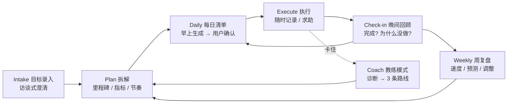
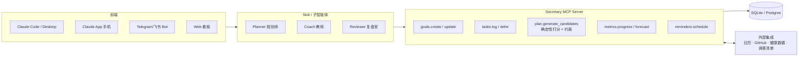

# AI 个人秘书调研与设计方案

> English: [../en/design-proposals.md](../en/design-proposals.md)

> 📜 历史文档：写于项目定名 Mishu（秘书）之前，文中的 "Secretary"、`/sec-*` 命令是早期工作名。最终实现采用了方案 A，见 [通用范式规范](paradigm-spec.md)。

> 日期：2026-09-14
> 目标：基于 Claude 做一个通用的"AI 个人秘书"skill 或 pipeline。它能管理任何类型的目标，监督进度，每天给出事项清单，在用户卡住时给出路线建议。

---

## 1. 调研结论

### 1.1 结论先说

**类似的东西比预想的多，但都不完全符合需求。** 已有方案大致分三类：

| 类别 | 代表 | 能做什么 | 和需求的差距 |
|---|---|---|---|
| **Claude Code 上的"人生操作系统"模板** | [Dex](https://github.com/davekilleen/dex)、[lifeos-template](https://github.com/seandavi/lifeos-template)、[life-system](https://github.com/davidhariri/life-system)、[claude-code-cos](https://github.com/jimprosser/claude-code-cos)、[ai-chief-of-staff](https://github.com/Akshat2430/ai-chief-of-staff)、[ceo-personal-os](https://github.com/2389-research/ceo-personal-os) | Markdown 仓库，配 `/morning`、`/daily-plan`、`/weekly-review` 等命令；目标逐层拆解（季度→周→日） | ① 面向知识型工作者和管理层，核心场景是会议、邮件、人脉，**不是"任意目标"**；② 基本要用户自己触发，**缺少主动督促**；③ 没有按目标类型区分进度的衡量方式（减肥和写 App 用的是同一套 task 列表）；④ 没有中文支持，也不适配中国用户常用的工具 |
| **Anthropic 官方插件** | [knowledge-work-plugins / productivity](https://github.com/anthropics/knowledge-work-plugins/tree/main/productivity) | `TASKS.md`（Active / Waiting On / Someday / Done）、两层记忆（CLAUDE.md + memory/）、HTML 看板、`/start` 和 `/update` | 本质是**任务清单加上职场记忆**，没有目标层、进度模型、每日排程算法和教练能力。适合拿来当底座参考 |
| **独立的 AI 计划/问责 App** | Motion、Reclaim（自动排进日历）、Sunsama（引导式每日计划）、Nag Bot、Accountability Coach AI、Rocky.ai、GoalsWon（真人教练） | 自动排程、打卡、推送提醒、聊天式问责 | 数据封闭，也不能深度定制；日历排程类擅长"排时间"，不擅长"判断方向"；问责类大多只管单个习惯，不管多项目并行；价格每月 $19–25 |

零散的 skill 市场上也有一些，比如 mcpmarket 上的 Task Management、Personal Assistant skill，还有 Medium 上的 "Accountability Buddy" skill。它们大多只是简单的清单加打卡。

### 1.2 可以借鉴的设计

- **lifeos-template 的"反馈层"**：定期审计哪些目标已经停滞；每季度强制对每个陈旧目标做决定（重写目标，或者正式放弃）；记录决策时附带 30/90/365 天的预测，到期后回看。这能**防止计划慢慢烂掉**，也是大多数模板缺少的部分。
- **Dex 的目标层级**：战略支柱 → 季度目标（3–5 个）→ 本周重点（Top 3）→ 每日计划 → 任务池。另外它用 MCP 给任务分配唯一 ID，"在一处勾掉，所有地方同步"。
- **Sunsama 与 Motion 的理念之争**：Motion 认为计划是开销，应该全自动；Sunsama 认为计划这个动作本身就有价值，每天早上应该慢下来自己选。**我们的产品应该折中：AI 出草案，用户确认并修改。**
- **Claude 平台现在的能力**：
  - **Claude Code Routines**（2026 年 4 月上线）：在云端按 cron 定时运行，最短间隔 1 小时，**每次运行都没有记忆**，所以状态必须放在 git 仓库或外部系统里。
  - **桌面端 Scheduled Tasks**：在本地定时运行，电脑唤醒后会补跑错过的任务。
  - Skills、Hooks、MCP connectors（日历、Notion、Slack 等），以及 PushNotification。

### 1.3 需求缺口，也就是本产品要解决的问题

1. **任意类型的目标**：项目、习惯、一次性事务、找工作、学习，各自的"进度"定义都不一样。
2. **主动督促**：不是等用户来问，而是按时出现、跟进、逐步升级提醒。
3. **跨目标统一排程**：多个项目并行时，每天自动平衡"紧急 / 重要 / 太久没碰 / 能解锁其他任务"几类因素。
4. **卡住时有诊断**：先判断卡在哪（不清楚下一步？不想做？做不动？方向有疑问？负荷过重？），再给路线，而不是泛泛地鼓励。
5. **计划能自我修正**：连续推迟就触发拆解或重新审视，而不是无限顺延。
6. **中文和本地化**：中文交互；可对接滴答清单、飞书、微信等（可选）。

---

## 2. 共同的核心设计（与方案无关）

无论最后选哪个方案，下面这套**领域模型**和**工作循环**都通用。

### 2.1 核心循环



### 2.2 目标类型模板

一个"目标"就是一份文件或一条记录，按 **type** 决定怎么追踪。

| 类型 | 例子 | 进度怎么量 | 默认节奏 | 卡住时的诊断重点 |
|---|---|---|---|---|
| `project` 项目型 | 写一个 App、毕业设计 | 里程碑完成度，加上预计完成时间与截止日期的差距 | 每周复盘里程碑 | 下一步是否清晰？依赖是否被阻塞？ |
| `habit` 习惯/指标型 | 锻炼减肥、每天背单词 | **过程指标**（训练次数）+ **结果指标**（体重趋势）+ 连续天数 | 每日打卡，每周看趋势 | 触发条件和阻力在哪？目标定得太高？ |
| `errand` 事务型 | 采购、办证、寄快递 | 完成或未完成 | 按截止日期，攒到一起批量处理 | 基本不会卡；卡住多半是缺信息 |
| `pipeline` 漏斗/探索型 | 找工作、找房、融资 | 漏斗各阶段数量（投递→笔试→面试→offer），每周行动配额 | 每周看转化率 | 是量不够还是转化率低？定位要不要调整？ |
| `learning` 学习型 | 考研、学一门技术 | 大纲覆盖度，加上**以产出检验**（做题正确率、能不能讲出来、做出小项目） | 每日学习，间隔复习 | 是在假装学习（只看不练）吗？ |

每个目标文件的建议结构（YAML frontmatter + Markdown）：

```yaml
---
id: g-2026-007
title: 上线记账 App v1
type: project
area: 事业          # 事业 / 学习 / 健康 / 生活 / 财务 / 关系
priority: P1        # P0-P3
status: active      # draft / active / paused / done / dropped
deadline: 2026-11-30
why: 作品集 + 验证独立开发能力      # 动机，教练模式会用到
success_criteria: App Store 上架，10 个真实用户
cadence: weekly_review
effort_budget: 8h/week
milestones:
  - {id: m1, title: 需求与原型, due: 2026-09-25, status: done}
  - {id: m2, title: 核心记账功能, due: 2026-10-20, status: active}
  - {id: m3, title: 上架, due: 2026-11-30, status: todo}
next_actions:
  - {id: t41, title: 实现账目 CRUD 本地存储, est: 90m, milestone: m2, deferred: 0}
  - {id: t42, title: 调研 iCloud 同步方案, est: 45m, milestone: m2, deferred: 2}
---
## 日志
- 2026-09-13 完成原型评审，决定砍掉多币种
```

### 2.3 每日清单生成规则

**输入**：所有 active 目标的 next_actions、习惯当天是否到期、截止日期、昨天的完成情况和遗留、当天的日历空闲时间（可选），以及**用户早上报的精力和可用时长**（例如"今天 4 小时，精力 3/5"）。

**打分**（由 LLM 按规则判断；如果用方案 C，就在代码里计算）：

```
score = 紧迫度(离截止日期还有多少余量)
      + 重要度(目标优先级)
      + 冷落度(距离上次推进的天数 ÷ 应有节奏)
      + 解锁价值(完成后能解开多少依赖)
      + 习惯到期
```

**硬约束**：
- 总预估时长 ≤ 可用时长 × 0.7，留出缓冲；
- **主线任务（MIT）最多 3 个**；
- 每个 active 目标在它的节奏周期内至少被推进一次，防止某个项目被遗忘；
- 同一任务**推迟 3 次以上就不再排进清单**，改为触发"拆解或质疑"：是太大、不清楚，还是其实不想做？
- 精力低的日子自动换成低认知负荷的任务，例如事务和整理。

**输出格式**：

```
📅 9月14日 周日 · 可用 4h · 精力 3/5

🎯 今日主线（必做）
  1. [记账App] 实现账目 CRUD 本地存储 · 90m
  2. [找工作] 投递 3 家（清单已备好）· 45m
⚡ 碎片时间（事务）
  - [采购] 下单显示器支架 · 10m
🔁 习惯
  - [减肥] 力量训练 A 组 · 40m（本周 2/4）
👀 等待他人
  - [找工作] 字节二面结果（已等 5 天，建议周二跟进）
⚠️ 提醒
  - "调研 iCloud 同步" 已推迟 2 次，今晚回顾时我们拆一下它
```

### 2.4 督促机制：逐步升级，不唠叨

| 级别 | 触发条件 | 秘书的动作 |
|---|---|---|
| L0 | 正常推进 | 只发早间清单和晚间回顾 |
| L1 | 当天主线没做 | 晚间回顾时问原因（给选项：没时间 / 不清楚 / 不想做 / 被阻塞） |
| L2 | 同一任务推迟 3 次，或目标 7 天没动 | 主动建议把任务拆小，或者只做 15 分钟的"最小启动版" |
| L3 | 目标连续两周落后于计划 | 周复盘里给出预计延期多少，让用户**明确选择**：延期 / 砍范围 / 暂停 / 放弃 |
| L4 | 同时有 3 个以上目标亮红灯 | 进入"负荷审查"，强制把目标数量减到合理范围 |

还可以设定**语气**（温和陪伴 / 教练 / 严格督促），以及**证据型打卡**：GitHub commit、运动 App 截图、体重记录，都可以作为"真的做了"的依据。

### 2.5 教练模式（用户卡住或迷茫时）

先诊断，再给路线：

1. **不清楚**（不知道下一步干什么）→ 拆到一个 ≤25 分钟、可以马上开始的第一步。
2. **不想做**（抵触、拖延）→ 缩小任务，先做 2 分钟，把它和已有习惯绑在一起，重新提一下 `why`。
3. **做不动**（缺能力或资源）→ 给学习路径、可以求助的人或社区、替代方案。
4. **怀疑方向**（这个目标还值得做吗）→ 回到 success_criteria 重新评估，允许暂停或放弃，并记录成一条决策。
5. **负荷过重** → 列出所有目标，一起做取舍。

**输出固定为"3 条路线 + 各自的代价 + 我的推荐"**，用户选定后自动更新计划。

---

## 3. 设计方案

### 方案 A：纯 Skill + 本地 Markdown 仓库（轻量、本地优先）

**形态**：一个 Claude Code skill（或一个包含多个 skill 的 plugin），数据放在本地文件夹里，最好用 git 管理。

```
~/Secretary/                     # 用户的"秘书档案库"
├── CLAUDE.md                    # 用户画像：作息、偏好、语气、每周可用时间
├── goals/
│   ├── g-2026-007-记账app.md
│   ├── g-2026-008-减肥.md
│   └── _archive/
├── inbox.md                     # 随手记下的想法和待办
├── daily/2026-09-14.md          # 每日清单 + 晚间回顾记录
├── weekly/2026-W37.md           # 周复盘
├── decisions/                   # 重大决策记录（带回看日期）
└── dashboard.html               # 可选：由脚本生成的可视化看板
```

**命令**：

| 命令 | 作用 |
|---|---|
| `/sec-setup` | 首次访谈：了解你的作息、各生活领域、当前所有目标，生成 CLAUDE.md 和目标文件 |
| `/sec-goal` | 新增或修改目标：访谈式澄清，自动判断类型，拆出里程碑和下一步 |
| `/sec-today` | 生成今日清单（先问精力和可用时长） |
| `/sec-done` / `/sec-log` | 随时记录进展 |
| `/sec-checkin` | 晚间回顾：逐项确认，询问原因，结转遗留 |
| `/sec-week` | 周复盘：各目标速度、预计完成时间、红黄绿灯、下周 Top 3 |
| `/sec-stuck` | 教练模式 |
| `/sec-audit` | 月度审计：停滞的目标、目标过多、从来没推进过的领域 |

**自动化**：用 Claude 桌面端的 Scheduled Tasks，每天 8:00 运行 `/sec-today`，22:00 提醒 `/sec-checkin`，周日运行 `/sec-week`。

| 优点 | 缺点 |
|---|---|
| 零基础设施，一两天就能做出 MVP | 督促依赖电脑开着，手机端体验弱 |
| 数据透明、可读，用 Obsidian 或任意编辑器就能看 | 由 LLM 解析 Markdown 来统计进度，数字可能不准 |
| 最容易分享：别人 clone 模板就能用 | 晚间回顾需要用户主动打开 Claude |
| 和 Claude Code 原生契合（skill、memory、hooks） | 文件多了之后，每次读取的上下文成本会上升 |

**适合**：先给自己用，快速验证流程是否好用。

---

### 方案 B：Plugin + 私有 Git 仓库 + 云端 Routines + 消息推送（主动督促）

**形态**：在方案 A 的数据结构基础上，把"大脑"搬到云端定时跑，把"触达"搬到手机上。

```mermaid
flowchart TB
  subgraph Cloud[Claude Code Routines 云端]
    R1[08:00 早间规划 routine]
    R2[21:30 晚间回顾 routine]
    R3[周日 20:00 周复盘 routine]
  end
  Repo[(私有 GitHub 仓库<br/>goals/ daily/ weekly/)]
  Bot[消息通道<br/>Telegram / 飞书 / 邮件 / Slack]
  User((用户 · 手机))
  Local[本地 Claude Code<br/>深度对话 / 教练模式]

  R1 -- 读状态 --> Repo
  R1 -- 提交今日清单 --> Repo
  R1 -- 推送清单 --> Bot --> User
  User -- 回复"1✅ 2❌ 没时间" --> Bot
  Bot -- webhook 触发 --> R2
  R2 -- 更新进度 --> Repo
  Local <--> Repo
```

**关键设计点**：
- Routines **每次运行都没有记忆**，所以**仓库就是唯一的状态来源**，每次运行结束都要 commit。
- 用户的回复通过 Routine 的 **API trigger**（每个 routine 有独立的 HTTP 端点）回流。需要一个很小的 bot 中转，比如 Cloudflare Worker，或飞书/Telegram 机器人。
- 深度对话（录入目标、教练模式）仍然在本地 Claude Code 或 Claude App 里进行，读写同一个仓库。
- 提醒逐步升级可以做成独立的 routine：检测到超期就追加一条消息。

| 优点 | 缺点 |
|---|---|
| **真正的主动督促**，手机上就能收到和回复 | 需要搭建消息 bot 和 webhook，有一定工程量 |
| 不依赖电脑开机 | Routines 最短间隔 1 小时，也会占用 Claude 用量额度 |
| 仓库的 git 历史天然就是进度审计记录 | 快速回复被解析成结构化更新，容易出错，需要容错设计 |
| 对别人来说是 fork 仓库、配置 bot，门槛中等 | 要把个人数据交给第三方消息平台，需要考虑隐私 |

**适合**：A 的流程跑顺之后，想要"真的有人盯着我"的体验。

---

### 方案 C：MCP Server + 结构化数据库 + 多智能体（完整产品化）

**形态**：自己写一个 **Secretary MCP Server**（Python 或 TypeScript，存储用 SQLite），**确定性的逻辑交给代码，判断和对话交给 LLM**。Claude Code、Claude Desktop、Claude App（通过远程 MCP）和 bot 都可以作为前端。



**分工**：
- **代码负责**：数据增删改、打分排序、时间容量约束、进度百分比、燃尽曲线和完成时间预测、连续天数、推迟计数、定时提醒。
- **LLM 负责**：录入目标时的访谈、把模糊目标拆成 SMART 目标、从候选任务里做最终取舍并解释原因、教练诊断、复盘时的洞察和措辞。
- **子智能体**：Planner 负责每日和每周规划；Coach 负责卡住时的诊断；Reviewer 负责复盘，并扮演唱反调的角色，比如"你这个月加了 4 个新目标但一个都没完成"。

| 优点 | 缺点 |
|---|---|
| 进度数字准确，可以画趋势图、做预测 | 开发量最大，要几周 |
| 能同时支持多个前端，手机上也能用 | 需要部署；远程 MCP 还要处理鉴权 |
| 能对接外部数据做"证据型督促"（GitHub commit、体重、日历） | 数据不再是"打开就能读"的文本（可以提供导出） |
| 最适合"任何人都能用"的产品形态 | 做早了容易过度设计 |

**变体 C'（外挂式）**：不自建数据库，直接用 **滴答清单 / Notion / Todoist** 的 MCP 当存储和提醒通道，秘书只负责"大脑"那层。好处是手机提醒和 UI 现成；坏处是被对方的数据模型限制（比如很难表达漏斗型、指标型目标）。

---

## 4. 方案对比与推荐

| 维度 | A 纯 Skill | B Skill + 云端推送 | C MCP 产品化 |
|---|---|---|---|
| MVP 耗时 | 1–2 天 | 1 周 | 3–6 周 |
| 主动督促 | ★★ | ★★★★ | ★★★★ |
| 进度准确性 | ★★ | ★★ | ★★★★★ |
| 手机体验 | ★ | ★★★★ | ★★★★ |
| 分享和复用门槛 | 最低 | 中 | 中高 |
| 维护成本 | 低 | 中 | 高 |

### 推荐：分阶段演进，A → B → C，数据结构从第一天就统一

1. **第 1 阶段（本周）**：做**方案 A**。重点打磨四件事：目标类型模板、每日清单规则、晚间回顾、教练模式。**自己用两周**，记录哪些地方不好用。
2. **第 2 阶段**：在 A 的基础上加上**方案 B 的推送**。可以先用最简单的通道（桌面 Scheduled Task + PushNotification，或者邮件），确认真的需要手机双向回复后再做 bot。
3. **第 3 阶段**：如果 Markdown 统计开始出错，或者要给别人用，就把"数据和计算"那层抽成 **MCP Server（方案 C）**，skill 层基本不用改。

**关键原则**：
- **AI 出草案，用户拍板**：每日清单必须经过用户确认和调整才生效，保留"计划"这个动作本身的价值。
- **少即是多**：主线任务最多 3 个，同时 active 的目标有上限（建议不超过 5 个）。
- **允许失败并重新规划**：推迟不是罪，但要触发诊断；放弃目标也要记成一次正式决策。
- **量化优先**：能用数字就不用感觉，比如"本周力量训练 2/4 次"，而不是"最近练得还行"。

---

## 5. 需要你决定的问题

1. **主要使用场景**：你主要在电脑前（Claude Code / Desktop），还是希望在手机上收到提醒并回复？这决定第一阶段要不要带上推送。
2. **数据放哪**：纯本地 Markdown？私有 GitHub 仓库？还是接入你已经在用的工具（滴答清单、Notion、飞书）？
3. **督促强度和语气**：温和陪伴 / 教练 / 严格督促？
4. **可以接入哪些外部数据作为证据**：日历、GitHub、健康数据等？
5. **给谁用**：先给自己用，还是一开始就按"开源模板，任何人都能装"来设计（这会影响配置化程度和文档工作量）？

---

## 参考来源

- [Dex – AI Chief of Staff](https://github.com/davekilleen/dex)
- [lifeos-template](https://github.com/seandavi/lifeos-template)
- [life-system](https://github.com/davidhariri/life-system)
- [claude-code-cos](https://github.com/jimprosser/claude-code-cos)
- [ai-chief-of-staff](https://github.com/Akshat2430/ai-chief-of-staff)
- [ceo-personal-os](https://github.com/2389-research/ceo-personal-os)
- [claude-task-manager](https://github.com/vibehat/claude-task-manager)
- [Anthropic knowledge-work-plugins / productivity](https://github.com/anthropics/knowledge-work-plugins/tree/main/productivity)
- [Claude Code for Life #2: A Personal AI Chief of Staff (Medium)](https://medium.com/data-science-collective/claude-code-for-life-2-a-personal-ai-chief-of-staff-for-daily-work-357b6c35573f)
- [Beyond Coding: Your Accountability Buddy with Claude Code Skill (Medium)](https://medium.com/@ooi_yee_fei/beyond-coding-your-accountability-buddy-with-claude-code-skill-45f91b54408f)
- [Claude Code Routines 指南 (MakerKit)](https://makerkit.dev/blog/tutorials/claude-code-routines-guide)
- [Claude Code Scheduled Tasks 指南](https://claudefa.st/blog/guide/development/scheduled-tasks)
- [Sunsama vs Motion vs Reclaim (Skedul.AI)](https://skedul.ai/blog/sunsama-vs-motion-vs-reclaim)
- [Best Accountability Apps 2026 (GoalsWon)](https://www.goalswon.com/blog/23-apps-that-will-keep-you-accountable-and-motivated-to-achieve-all-your-personal-goals/)
- [Nag Bot](https://nag.bot/) · [Accountability Coach AI](https://accountabilitycoach.ai/)
