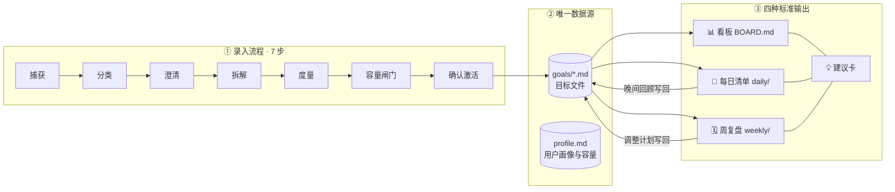
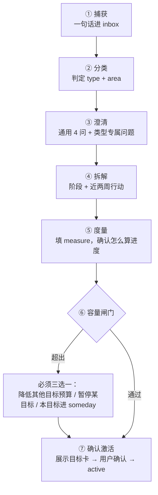

# Mishu（秘书）通用范式规范

> English: [../en/paradigm-spec.md](../en/paradigm-spec.md)

> 这份规范定义：**目标怎么进来（录入流程）**、**数据怎么存（统一模型）**、**信息怎么呈现（四种标准格式）**。
> 设计原则：**一种模型装下所有目标，一套语言贯穿所有输出。** 用户每天看到的东西结构永远一样，只有内容在变。

---

## 0. 总览：一张图看懂



**三条铁律**：
1. **唯一数据源**：目标、阶段、行动、日志只存在 `goals/*.md` 里。每日清单和周复盘都是"日志 + 引用"，看板是自动生成的视图。
2. **所有东西都有 ID**：清单、看板、建议里提到的每个事项都要带 ID（如 `G01.T05`），能追溯回目标文件。
3. **AI 不手算数字**：进度百分比、节奏灯、本周投入都由脚本按公式算出，AI 只负责判断和措辞。

---

## 1. 统一词汇表

所有输出只使用这里定义的符号和代码。

### 1.1 ID 规则

| 对象 | 格式 | 例子 |
|---|---|---|
| 目标 Goal | `G` + 两位序号 | `G01` |
| 阶段 Phase | `目标ID.M` + 序号 | `G01.M2` |
| 行动 Task | `目标ID.T` + 序号 | `G01.T05` |
| 决策 Decision | `目标ID.D` + 序号 | `G01.D03` |
| 建议 Advice | `A` + 日期 + 序号 | `A0914-1` |

在目标文件内部可以省略目标前缀（直接写 `T05`），跨文件引用时必须写全。

### 1.2 目标类型

| 图标 | type | 中文 | 判定依据 |
|---|---|---|---|
| 🏗 | `project` | 项目型 | 有明确交付物，需要分多个阶段完成 |
| 🔁 | `habit` | 习惯型 | 靠重复行为改变某个指标或状态 |
| 📦 | `errand` | 事务型 | 几步就能办完，总投入不超过 3 小时 |
| 🎯 | `pipeline` | 漏斗型 | 结果取决于外部选择，需要大量尝试（求职、找房、约稿） |
| 📚 | `learning` | 学习型 | 目标是掌握知识或技能 |

### 1.3 状态

**目标状态** `status`：

`inbox`（刚捕获）→ `draft`（录入中）→ `active`（进行中）⇄ `paused`（暂停）→ `done`（完成）/ `dropped`（放弃）

另有 `someday`（以后再说），它不占容量。

**行动状态**用复选框标记：

| 标记 | 含义 |
|---|---|
| `[ ]` | 待办 |
| `[/]` | 进行中 |
| `[x]` | 完成 |
| `[!]` | 阻塞 / 等待他人 |
| `[-]` | 取消 |

### 1.4 节奏灯（所有目标通用）

| 灯 | 含义 | 规则（详见 §3.3） |
|---|---|---|
| 🟢 | 正常 | 节奏比 ≥ 0.9 |
| 🟡 | 注意 | 节奏比 0.7–0.9，或超过 `stale_days` 天未推进 |
| 🔴 | 风险 | 节奏比 < 0.7、截止日期有风险，或超过 2×`stale_days` 天未推进 |
| ⚪ | 未开始 | 已激活但开始日期未到 |
| ⏸ | 暂停 | status = paused |
| ✅ | 完成 | status = done |

### 1.5 执行结果码（晚间回顾用）

| 符号 | 含义 |
|---|---|
| ✓ | 完成 |
| ◐ | 部分完成 |
| ✗ | 未做 |
| ➜ | 主动改期 |
| ✂ | 取消（不再需要） |

### 1.6 未完成原因码（诊断的数据基础）

| 码 | 含义 | 对应的教练策略 |
|---|---|---|
| `T` | 没时间（被其他事占用） | 检查容量，调整预算 |
| `E` | 精力不足 | 换到低负荷时段，或做最小版本 |
| `U` | 不清楚怎么做或下一步是什么 | **拆解**，明确第一步 |
| `A` | 不想做（抵触、拖延） | 缩小任务，先做 2 分钟，重温 why |
| `B` | 被阻塞（等人、缺资源） | 标记 `[!]`，安排跟进或找替代 |
| `O` | 低估了工作量 | 修正预估，拆分剩余部分 |
| `P` | 计划变了 | 取消或重排 |

### 1.7 优先级

`P0` 必须（不做会有严重后果）· `P1` 重要 · `P2` 想做 · `P3` 顺便

优先级在录入时通过**和现有目标两两比较**来确定，而不是凭感觉填。

---

## 2. 目录结构

```
MishuVault/                     # 用户的秘书档案库（与 skill 代码分开）
├── profile.md                  # 用户画像：容量、作息、偏好、上限
├── inbox.md                    # 随手捕获，等待录入
├── BOARD.md                    # 📊 看板（自动生成，不要手改）
├── dashboard.html              # 📊 网页看板（自动生成，只读）
├── goals/
│   ├── G01-记账App.md
│   ├── G02-减肥.md
│   └── _archive/               # done / dropped 的目标
├── daily/
│   └── 2026-09-14.md           # 📅 每日清单 + 晚间回顾
├── weekly/
│   └── 2026-W37.md             # 🗓 周复盘
├── evidence/                   # 用户同意保存的证据文件
└── .mishu/                     # 文件哈希、审计日志、建议卡记录

# 校验、计算、渲染由 skill 中的 mishu.py 完成，档案库里不放代码
```

---

## 3. 统一数据模型

### 3.1 用户画像 `profile.md`

```yaml
---
name: 小林
weekly_capacity: 25h        # 每周能分给所有目标的总时长
daily_default: 3h           # 工作日默认可用
weekend_default: 5h
wip_limit: 5                # 同时 active 的目标上限（habit 按 0.5 个计）
stale_days: 7               # 超过几天未推进亮黄灯
tone: coach                 # gentle / coach / strict
day_start: "08:30"
checkin_time: "21:30"
areas: [事业, 学习, 健康, 生活, 财务, 关系]
---
## 背景
（在读/在职、作息特点、常见干扰因素……）
```

### 3.2 目标文件：通用骨架

**每个目标，不论类型，都是同一个骨架。** 类型只决定 `measure` 怎么填。

```markdown
---
id: G01
title: 上线记账 App v1
type: project
area: 事业
priority: P1
status: active
created: 2026-09-14
start: 2026-09-15
deadline: 2026-11-30        # 硬截止加 !，如 2026-11-30!
why: 作品集 + 验证独立开发能力
done_when: App Store 上架，且有 10 个真实用户在用
budget: 8h/w
review: weekly
measure:
  progress: phases          # 进度怎么算
  pace: timeline            # 节奏怎么判断
phases:
  - {id: M1, title: 需求与原型, weight: 1, due: 2026-09-25, status: done}
  - {id: M2, title: 核心记账功能, weight: 2, due: 2026-10-20, status: active}
  - {id: M3, title: 打磨与上架, weight: 1, due: 2026-11-30, status: todo}
---

## 行动
- [x] T01 画出 5 个核心页面线框图 · 90m · M1
- [x] T02 确定技术栈 · 45m · M1
- [/] T05 实现账目 CRUD 本地存储 · 120m · M2 · due:09-20
- [ ] T06 调研 iCloud 同步方案 · 45m · M2 · defer:2
- [!] T07 等设计朋友反馈图标 · M2 · wait:小王 · since:09-10

## 日志
- 2026-09-13 | T02 | ✓ | 45m | 选定 SwiftUI + SwiftData
- 2026-09-14 | T05 | ◐ | 60m | 模型层完成，UI 未接

## 决策
- 2026-09-13 | D01 | 砍掉多币种支持 | 原因：v1 聚焦 | 回看：2026-12-01
```

**行动行语法**（固定顺序，用 ` · ` 分隔）：

```
- [状态] T序号 动词开头的标题 · 预估时长 · 所属阶段 · [可选字段…]
```

可选字段：
- `due:MM-DD`：截止日期
- `defer:N`：已推迟次数
- `every:mon,wed,fri`：习惯的重复规则
- `qty:10`：数量型任务的量
- `wait:某人`、`since:MM-DD`：阻塞时等谁、从哪天开始
- `min:10m`：最小版本（精力差的时候做这个）

**日志行语法**：

```
- 日期 | 引用 | 结果码 | 用时或数值 | 备注
```

指标类日志把"引用"写成指标名，例如：`- 2026-09-14 | 体重 | = | 76.4kg | 早起空腹`。

### 3.3 度量：两个维度，自由组合

所有类型的目标都输出同样的**"进度三件套"**：**进度 %**、**节奏灯**、**下一步**。差别只在计算方式：

**进度 `progress` 的四种算法**

| 值 | 公式 | 适用场景 |
|---|---|---|
| `phases` | Σ(阶段权重 × 阶段完成度) ÷ Σ权重。阶段完成度：done=1，todo=0，active=该阶段已完成行动预估时长 ÷ 总预估时长 | 项目、漏斗 |
| `metric` | (当前值 − 基线) ÷ (目标值 − 基线)，限制在 0–100% | 减肥、存钱、跑步配速 |
| `units` | 已掌握单元数 ÷ 总单元数 | 学习 |
| `checklist` | 已完成行动数 ÷ 总行动数 | 事务 |

**节奏 `pace` 的三种算法**

| 值 | 节奏比公式 | 适用场景 |
|---|---|---|
| `timeline` | 实际进度 ÷ 按时间应有的进度。应有进度 = (今天 − start) ÷ (deadline − start)。前 10% 时间内只按"是否停滞"判断 | 有截止日期的项目、学习 |
| `frequency` | 近 7 天完成量 ÷ 每周目标量 | 习惯、漏斗（每周投递配额） |
| `deadline` | 离截止 ≤ 2 天且未完成 → 🔴；≤ 7 天且未开始 → 🟡；其余 🟢 | 事务 |

**类型的默认组合**（录入时自动填好，用户可以改）：

| 类型 | progress | pace | measure 里需要额外填写 |
|---|---|---|---|
| 🏗 project | phases | timeline | — |
| 🔁 habit | metric | frequency | `metric`、`frequency` |
| 📦 errand | checklist | deadline | — |
| 🎯 pipeline | phases | frequency | `funnel`、`frequency` |
| 📚 learning | units | timeline | `units` |

> 遇到新类型的目标，只要选一个 progress 和一个 pace 就能装进这个模型，**不需要新增类型**。

各类型 `measure` 的写法：

```yaml
# 🔁 habit — 减肥
measure:
  progress: metric
  pace: frequency
  metric: {name: 体重, unit: kg, baseline: 78, target: 70, current: 76.4, direction: down}
  frequency: {task: T01, per_week: 4}
```

```yaml
# 🎯 pipeline — 找工作
measure:
  progress: phases          # 阶段：简历打磨 → 集中投递 → 面试 → 选 offer
  pace: frequency
  funnel:
    - {stage: 投递, count: 23}
    - {stage: 初筛通过, count: 6}
    - {stage: 面试, count: 3}
    - {stage: offer, count: 0, target: 1}
  frequency: {task: T03, per_week: 10, unit: 家}
```

```yaml
# 📚 learning — 学 Rust
measure:
  progress: units
  pace: timeline
  units: {name: 章节, total: 20, done: 6, mastered: 5}
  mastery_check: 每章完成课后练习且能不看书写出示例
```

```yaml
# 📦 errand — 买显示器支架
measure:
  progress: checklist
  pace: deadline
```

**停滞覆盖规则**：只要距离最后一条日志超过 `stale_days`，节奏灯至少是 🟡；超过 2 倍就是 🔴。这条规则对所有类型都生效。

---

## 4. 目标录入流程（7 步）

**原则：AI 先给草案，用户只需要确认或修改。** 每一步都给出建议值，不让用户面对空白表单。



### ① 捕获
用户随口说一句（比如"我想减肥"或"下周要买显示器"），AI 追加到 `inbox.md`，**不打断当前的事**。可以立即录入，也可以攒到周复盘时统一处理。

### ② 分类：判定树

```
这件事几步就能办完、总投入不超过 3 小时？ ──是──▶ 📦 errand
        │否
目标是掌握一项知识或技能？ ──是──▶ 📚 learning
        │否
结果主要取决于别人的选择，需要大量尝试？ ──是──▶ 🎯 pipeline
        │否
核心是靠重复行为改变一个指标或状态？ ──是──▶ 🔁 habit
        │否
        ▼
      🏗 project
```

**混合目标**（比如"考研"既是学习又包含报名手续）：按**"最终成败取决于什么"**确定主类型，其余部分作为普通行动挂在这个目标下。如果子部分本身很大，就拆成独立目标，并在 `why` 里注明关联。

### ③ 澄清：问题卡

**通用 4 问**（所有类型都要问；AI 先给建议答案）：

| # | 问题 | 写入字段 |
|---|---|---|
| 1 | 做到什么程度算完成？（必须能观察到） | `done_when` |
| 2 | 为什么要做？（卡住时会用到） | `why` |
| 3 | 最晚什么时候？硬截止还是软截止？ | `deadline` |
| 4 | 每周愿意投入多少时间？和现有目标比，它排第几？ | `budget`、`priority` |

**类型专属问题**（每类最多 3 个）：

| 类型 | 专属问题 |
|---|---|
| 🏗 project | 大致分几个阶段？现在已经进行到哪？有什么外部依赖？ |
| 🔁 habit | 结果指标、现在的值和目标值？每周做几次、在什么时间做？状态最差的那天，最小版本做什么？ |
| 📦 errand | 需要哪些步骤或信息？预算多少？ |
| 🎯 pipeline | 漏斗有哪几个阶段？每周行动配额多少？最终需要几个结果？ |
| 📚 learning | 用什么材料？按什么划分单元？怎么检验真的学会了（必须是产出，比如做题、讲出来、做个小项目）？ |

### ④ 拆解：行动质量标准
- **动词开头**，完成标准能观察到。✗"研究同步" ✓"调研 3 种 iCloud 同步方案并写对比表"
- **预估 15 分钟到 2 小时**，超过 2 小时必须再拆。
- **滚动式规划**：只把**当前阶段和未来两周**拆成具体行动，远期阶段只保留阶段名。
- 每个 active 目标**任何时候都至少有 1 个 `[ ]` 下一步**，否则校验不通过。

### ⑤ 度量
按类型默认组合填好 `measure`，向用户确认一句话，比如："进度按体重从 78kg 降到 70kg 计算，节奏看每周是否练满 4 次。"

### ⑥ 容量闸门
同时检查两条：
- 所有 active 目标的 `budget` 之和 ≤ `weekly_capacity` × 0.8
- active 目标数 ≤ `wip_limit`（habit 按 0.5 个计）

超出时不允许直接激活，**必须由用户做出取舍**，并记录为一条决策。

### ⑦ 确认激活：准入清单（Definition of Ready）

| 检查项 | 必须 |
|---|---|
| `done_when` 可观察 | ✅ |
| 有 `deadline`，或者 habit 有 `frequency` | ✅ |
| `budget` 已填且通过容量闸门 | ✅ |
| `measure` 完整 | ✅ |
| 至少 1 个 ≤ 2 小时的下一步 | ✅ |
| `why` | 建议填 |

全部通过后，展示**目标卡**（与看板上的卡片格式相同），用户确认后状态改为 `active`，并重新生成看板。

---

## 5. 四种标准输出格式

### 5.1 📊 看板 `BOARD.md`

由脚本生成，**结构固定为 6 个区块**（新增「已完成」）。

```markdown
# 📊 秘书看板
更新：2026-09-14 21:40 · 第 37 周 · 本周投入 14.5h / 容量 25h

🟢 3　🟡 1　🔴 1　⏸ 1

## ⚠️ 需要关注
- 🔴 G03 找工作 — 近 7 天投递 3/10 家，已连续 2 周不足
- 🟡 G01 记账App — G01.T06 已推迟 2 次

## 🎯 目标总览
| ID | 目标 | 类型 | 进度 | 节奏 | 截止 | 本周 | 下一步 |
|---|---|---|---|---|---|---|---|
| G01 | 上线记账 App v1 | 🏗 | ▓▓▓▓░░░░░░ 42% | 🟡 | 11-30 | 6h/8h | T05 实现账目 CRUD |
| G02 | 减到 70kg | 🔁 | ▓▓░░░░░░░░ 20% | 🟢 | — | 3/4 次 | T01 力量训练 |
| G03 | 拿到秋招 offer | 🎯 | ▓▓▓░░░░░░░ 30% | 🔴 | 11-15! | 3/10 家 | T08 整理目标公司清单 |
| G04 | 学完 Rust Book | 📚 | ▓▓▓░░░░░░░ 25% | 🟢 | 12-31 | 3h/4h | T12 第 7 章练习 |
| G05 | 买显示器支架 | 📦 | ▓▓▓▓▓░░░░░ 50% | 🟢 | 09-20 | — | T02 下单 |

## 🗂 目标卡片
### 🏗 G01 上线记账 App v1 · P1 · 事业
- **进度** ▓▓▓▓░░░░░░ 42%（M2 核心记账功能 进行中，应有进度 48%）
- **节奏** 🟡 节奏比 0.88
- **本周** 6h / 8h · 完成 3 项
- **下一步** G01.T05 实现账目 CRUD 本地存储 · 120m
- **风险** T06 推迟 2 次（原因：U 不清楚）

（其余目标卡片格式相同……）

## 🗓 本周重点（来自周复盘）
1. G03 恢复投递节奏：本周 10 家
2. G01 完成 M2 数据层
3. G02 保持 4 次训练

## ⏸ 暂停 / 💭 以后再说
- ⏸ G06 学吉他 — 暂停至 2026-10-15（决策 G06.D01）
- 💭 做个人网站
```

**目标卡片固定 5 行：进度、节奏、本周、下一步、风险。** 某一项没有内容时写"—"，不要省略这一行。

网页看板 `dashboard.html` 只读展示同一份数据，但刻意更安静：主栏放**今日主线和目标卡片**，侧栏放**需要关注、秘书建议、需要补充、已完成**。目标卡片只留标题、进度、节奏/截止/本周、下一步；点击卡片就展开阶段、编号行动清单、近 14 天投入图、日志和决策。今日清单只显示任务标题，展开才看到所属目标、编号和备注。习惯、事务和晚间回顾仍然写进 Markdown 每日清单，但不在网页看板上显示；回顾过的事项只在标题旁标出结果。数据为空时显示引导面板。

建议卡的选项**可以直接选**：选中之后卡片上出现同样的一键回复，复制成「秘书，关于「…」（A0914-1）：我选 A —— …」。

行动、今日清单和等待 / 跟进都带**复选框**。勾选不会改动档案库：状态只存在浏览器的 localStorage，右下角的小浮窗提供**「一键回复秘书」**，把勾选结果复制成一段现成的话（「秘书，今天（日期）的情况：✓ G02.T03 …」），粘回对话即可。档案库仍然只由 `mishu.py` 写入。

### 5.2 📅 每日清单 `daily/YYYY-MM-DD.md`

同一个文件分两段：早上生成计划，晚上追加回顾。

**早间计划的生成规则**：
- 早上先问两件事：今天可用多少时间？精力几分（1–5）？
- 候选来源：所有 active 目标的 `[ ]` 行动、今天到期的习惯、`[!]` 中需要跟进的项。
- 打分：紧迫度 + 重要度 + 冷落度 + 解锁价值 + 习惯到期。
- 约束：
  - 总时长 ≤ 可用时间 × 0.7
  - 🎯 主线最多 3 项
  - 精力 ≤ 2 时，主线换成低负荷任务或最小版本
  - `defer ≥ 3` 的行动不再排入清单，改为出一张"拆解"建议卡

```markdown
# 📅 2026-09-14 周日
可用 4h · 精力 3/5 · 计划 2h45m（上限 2h48m）

## 🎯 主线（最多 3 项）
- [ ] G01.T05 实现账目 CRUD 本地存储 · 90m
- [ ] G03.T08 整理目标公司清单（20 家）· 45m

## 🔁 习惯
- [ ] G02.T01 力量训练 A 组 · 30m（本周 2/4）

## ⚡ 事务（适合碎片时间，建议一次性处理）
- [ ] G05.T02 下单显示器支架 · 10m

## 👀 等待 / 跟进
- G01.T07 等小王反馈图标（已等 4 天）→ 建议今天发消息问一下

## 💡 秘书建议（最多 2 条）
> 💡 **A0914-1 [调整] G03 找工作 · 投递节奏落后** · L2
> **事实** 近 7 天投递 3/10；本周 2 次未做，原因都是 U（不清楚投哪家）
> **判断** 瓶颈是缺少目标公司清单，不是时间不够
> **选项**
> A. 今天先花 45m 建清单，下周配额不变 — 代价：本周投递数再少 1–2 家
> B. 配额降到 6 家/周 — 代价：预计拿到 offer 的时间推迟约 2 周
> **推荐** A（已排进今日主线）
> **需要你** 回复 A 或 B

---
## 🌙 晚间回顾（21:30 追加）
| 事项 | 结果 | 用时 | 原因 | 备注 |
|---|---|---|---|---|
| G01.T05 | ◐ | 60m | O | 模型层完成，UI 未接 |
| G03.T08 | ✓ | 50m | | 清单 22 家 |
| G02.T01 | ✓ | 35m | | |
| G05.T02 | ✗ | | T | |

**统计** 完成 2/4 · 主线 1.5/2 · 投入 2h25m
**写回** G01.T05 剩余拆为 T05b（接 UI，60m）；G05.T02 defer:1
**明日预排** G01.T05b · G03.T03 投递 5 家 · G05.T02
**一句话** （用户自评，可选）
```

**区块顺序永远是**：🎯 主线 → 🔁 习惯 → ⚡ 事务 → 👀 等待 → 💡 建议 → 🌙 回顾。某个区块为空时写"（无）"，不删除区块。

### 5.3 💡 建议卡（所有 AI 建议的唯一格式）

无论出现在每日清单、晚间回顾、周复盘，还是用户主动求助时，AI 给出的建议**都必须用这张卡**：

```markdown
> 💡 **{ID} [{类别}] {目标ID} {目标简称} · {一句话标题}** · {级别}
> **事实** {引用数据：数字、日志、原因码。不能凭空推断}
> **判断** {诊断：问题出在哪}
> **选项**
> A. {方案} — 代价：{会失去什么}
> B. {方案} — 代价：{…}
> C. {方案} — 代价：{…}   ← 最多 3 个
> **推荐** {选项字母}（{一句话理由}）
> **需要你** {明确的动作：回复字母 / 确认 / 无需操作}
```

**类别**：
| 类别 | 用途 |
|---|---|
| `提醒` | 到期、等待跟进、习惯漏做 |
| `调整` | 改计划、改预算、改配额 |
| `教练` | 卡住时的诊断与路线 |
| `洞察` | 复盘时发现的规律 |

**级别**（对应督促升级）：

| 级别 | 触发 | 是否需要用户决定 |
|---|---|---|
| L0 | 常规信息 | 否 |
| L1 | 当天主线未做 | 否，只记录原因 |
| L2 | 行动推迟 ≥ 3 次，或目标超过 `stale_days` 未推进 | 是：拆小 / 做最小版本 / 改期 |
| L3 | 连续 2 周 🔴 | 是：延期 / 砍范围 / 暂停 / 放弃 |
| L4 | 同时有 3 个以上 🔴，或容量超载 | 是：强制做一次负荷审查 |

**建议卡规则**：
1. **没有数据就不给建议**：「事实」一栏必须能在日志或目标文件里找到依据。
2. 选项最多 3 个，**每个都要写代价**；必须给出推荐。
3. 需要用户决定的建议，**用户回复之前不改动 active 计划**。
4. 用户做出选择后，写入对应目标的 `## 决策`，并注明是由哪张建议卡产生的。
5. **限量**：每日清单最多 2 张，晚间回顾最多 1 张，周复盘最多 3 张；用户主动求助时不限。级别高的优先。

**教练类建议卡的诊断顺序**（`/mishu stuck`）：先根据原因码判断卡在哪一类，再给路线。
`U 不清楚` → 拆解 · `A 不想做` → 缩小并重温 why · `B 被阻塞` → 跟进或找替代 · `T/E 没时间或没精力` → 查容量 · 怀疑方向 → 回到 `done_when` 重新评估，允许暂停或放弃。

### 5.4 🗓 周复盘 `weekly/YYYY-Www.md`

```markdown
# 🗓 2026-W37 周复盘（09-08 ~ 09-14）

## 📈 本周数据
投入 14.5h / 容量 25h · 计划完成率 68%（17/25）· 主线完成率 80%
未完成原因分布：T×3　U×3　A×1　O×1

## 🎯 各目标
| ID | 节奏 | 进度变化 | 本周投入 | 一句话 |
|---|---|---|---|---|
| G01 | 🟡 | 35% → 42% | 6h/8h | M2 数据层过半 |
| G03 | 🔴 | 25% → 30% | 2h/5h | 投递 3/10，卡在"投哪家" |

## 💡 洞察与调整（最多 3 张建议卡）
> 💡 **A0914-W1 [洞察] 全局 · 周末完成率比工作日高 2 倍** · L0
> …

## 🗓 下周计划
**Top 3**
1. …
2. …
3. …

**预算分配**：G01 8h · G03 5h · G02 3h · G04 4h · 缓冲 5h

**待处理**：inbox 2 条待录入 · 决策 G04.D02 到期回看
```

---

## 6. 命令与数据流矩阵

每个命令读哪些文件、写哪些文件都是固定的，避免到处乱改。

| 命令 | 作用 | 读 | 写 |
|---|---|---|---|
| `/mishu setup` | 首次使用：创建空档案库，访谈，录入第一批目标 | — | profile.md、inbox、初始 goals/ |
| `/mishu add` | 走 §4 的 7 步录入流程 | profile、goals、inbox | goals/新文件、inbox、看板 |
| `/mishu today` | 生成早间清单 | profile、goals、昨日 daily | daily/今天（计划段）、网页看板 |
| `/mishu log` | 随时记录进展 | goals | goals（日志、状态）、看板 |
| `/mishu checkin` | 晚间回顾 | daily/今天、goals | daily（回顾段）、goals、看板 |
| `/mishu stuck` | 教练模式 | goals、近期 daily | 决策记录，必要时改 goals |
| `/mishu status` | 查看或管理（暂停、完成、打开看板） | goals | 结构级修改时写 goals |
| `/mishu week` | 周复盘（规划中） | 本周 daily、goals | weekly/、goals、看板 |

**AI 与脚本的分工**：

| 由脚本 `mishu.py` 负责（确定性） | 由 AI 负责（判断和对话） |
|---|---|
| 校验格式、ID 唯一性、准入清单 | 录入访谈、分类、拆解 |
| 计算进度 %、节奏灯、本周投入 | 从候选任务里做取舍，并解释原因 |
| 候选任务打分排序 | 诊断原因、生成建议卡 |
| 渲染 BOARD.md 与 dashboard.html | 周复盘时的洞察和措辞 |
| 统计原因码分布、完成率 | 与用户确认后写回数据 |

---

## 7. 一致性保障清单

1. **唯一数据源**：所有状态只写在 `goals/*.md`，其他文件只引用 ID。
2. **渲染统一**：所有输出都由 `mishu.py` 渲染，AI 只提供选择和内容，不自由发挥版式。
3. **固定区块**：看板 6 块、目标卡片 5 行、每日清单 6 块、建议卡 6 栏。内容为空也保留结构。
4. **统一词汇**：只使用 §1 定义的 ID、图标、状态码和原因码。
5. **数字由脚本算**：AI 引用脚本输出的数字，不自己估算百分比。
6. **写后校验**：每次写入都由 `mishu.py` 自动校验，另可随时运行 `mishu.py validate`，不通过就先修复。用户手动改过文件也一样。
7. **输出限量**：主线 ≤ 3、建议卡 ≤ 2 张/日、选项 ≤ 3、专属问题 ≤ 3，防止信息过载。

---

## 附录：v0.1 实现修订

MVP 实现过程中，对规范做了以下补充和修正（已同步到 skill 与 mishu.py）：

1. **日志行增加证据列**，共 6 列：`日期 | 引用 | 结果码 | 用时或数值 | 证据码 | 备注`。原因码写在备注开头，如 `[U] …`。
2. **晚间回顾表增加「证据」列**：`事项 | 结果 | 用时 | 原因 | 证据 | 备注`。
3. **新增 `verify` 字段**（method / repo / when / fallback），用来规定每个目标的核验方式；新增证据码 🔍📷🔗💬⚙️。
4. **行动字段中的日期一律写成完整的 `YYYY-MM-DD`**，避免跨年时产生歧义。
5. **写入权限分为三级**（进度级 / 结构级 / 禁止）。结构级修改必须带 `--confirmed --reason`，执行后自动记录决策。
6. **命令形式改为 `/mishu <子命令>`**，或直接用自然语言。周复盘（`/mishu week`）尚在规划中。
7. **"没有下一步"在执行过程中只作为警告**（不再阻止进度写入）；行动全部完成时，提示用户确认是否结束目标。
8. **新增网页看板 `dashboard.html`**：由 mishu.py 与 BOARD.md 同步生成，只读，内容与 Markdown 看板和每日清单一致。Markdown 仍然是唯一数据源；看板上的复选框只存在浏览器，通过「复制给秘书」以文字形式交回。
9. **中英双语**：档案库的 `profile.lang`（`en` / `zh`）决定所有渲染输出的语言；目标文件的区块标题（`## Actions` / `## 行动`）、决策字段（`Reason:` / `原因：`）两种语言都能解析，切换语言后旧文件无需迁移。
10. **首次使用为空库**：安装后档案库为空，由 setup 流程引导用户录入第一批目标；仓库中的演示数据只在 `examples/` 中生成，不会进入用户档案库。
11. **已完成回溯**：目标设为 `done` 时自动记录 `completed: YYYY-MM-DD` 并归档；看板和网页看板新增「已完成」区块，每个目标一行简介（起止日期、用时、投入）；`mishu.py done` 列出全部已完成目标及结项说明。
